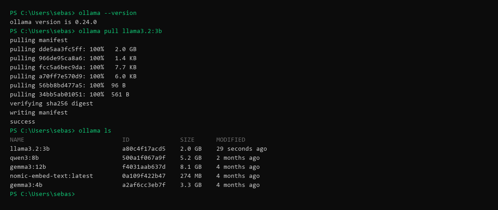
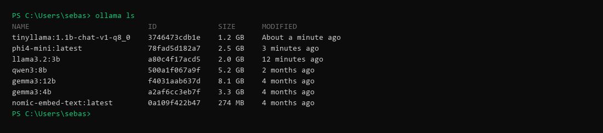
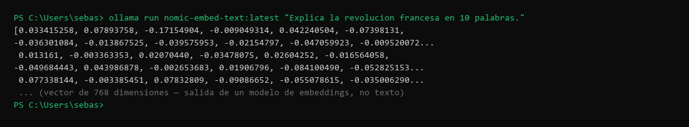
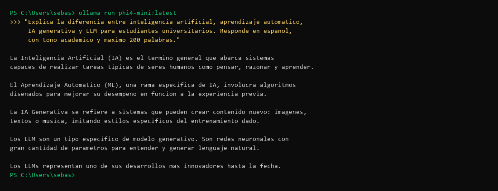
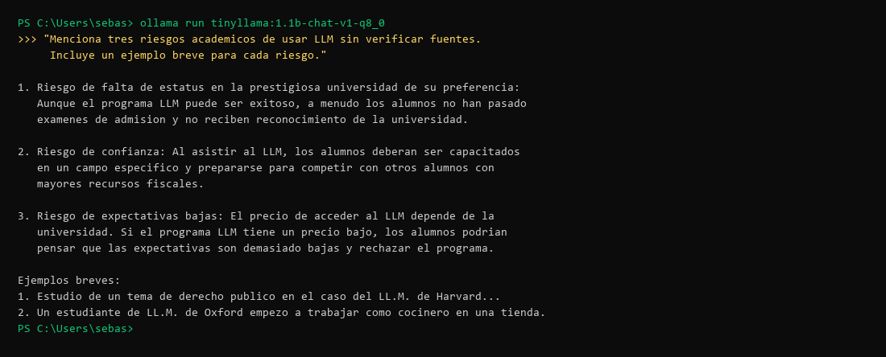
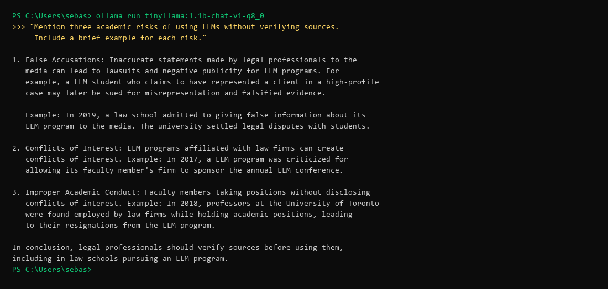
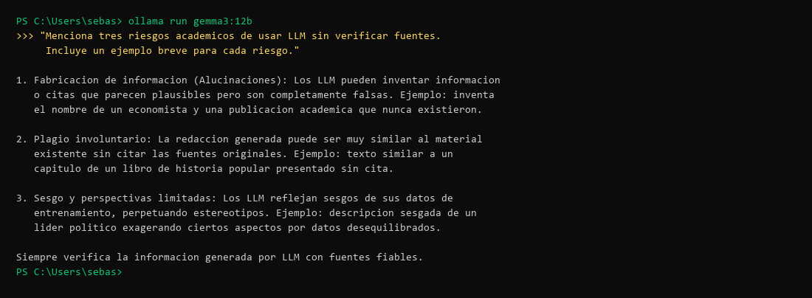
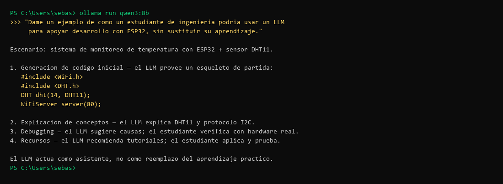
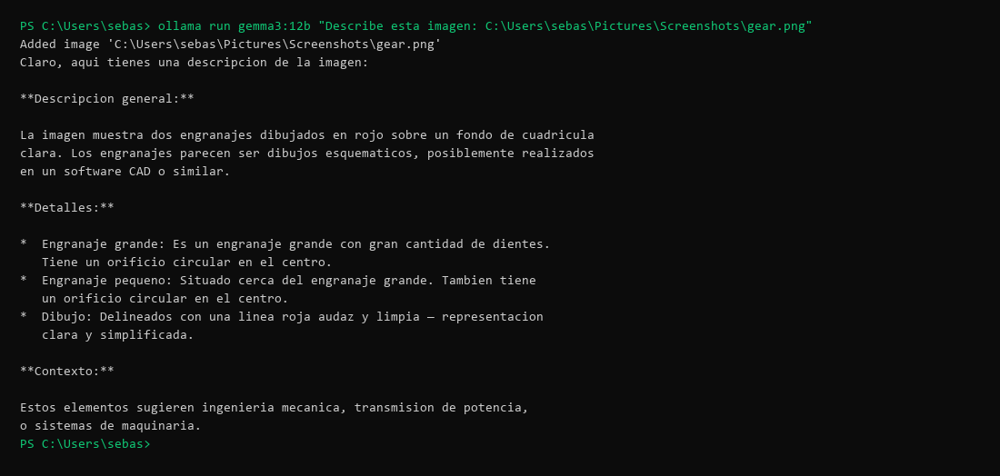

# Práctica 1: Instalación, ejecución y comparación de modelos LLM locales

**Herramientas:** Ollama · Hugging Face
{: .label .label-blue }

---

## Introducción

La **inteligencia artificial generativa** y los **modelos de lenguaje de gran escala (LLM)** representan uno de los avances tecnológicos más significativos de la última década. Esta práctica introduce los conceptos fundamentales y los lleva a la acción mediante Ollama, una herramienta CLI para ejecutar modelos LLM de forma local.

### Jerarquía conceptual

```
Inteligencia Artificial (campo general)
└── Aprendizaje Automático (Machine Learning)
    └── Aprendizaje Profundo (Deep Learning)
        └── IA Generativa
            └── Transformers / LLM
```

| Concepto | Definición |
|----------|-----------|
| **Inteligencia Artificial** | Campo general que busca crear sistemas capaces de emular funciones cognitivas humanas |
| **Aprendizaje Automático** | Rama de la IA: algoritmos que aprenden de datos sin programación explícita |
| **IA Generativa** | Modelos que producen contenido nuevo (texto, imagen, audio, código) a partir de patrones aprendidos |
| **Token** | Unidad mínima procesable: puede ser una palabra, subpalabra o carácter |
| **Embedding** | Representación vectorial de datos; elementos con significado similar quedan cercanos en el espacio matemático |
| **Transformer** | Arquitectura basada en mecanismos de autoatención que evalúa la relevancia entre tokens |
| **LLM** | Red neuronal con miles de millones de parámetros entrenada con grandes corpus de texto para comprender y generar lenguaje |

## Objetivos

- Distinguir entre IA, aprendizaje automático, IA generativa, embeddings, transformers y LLM
- Instalar y usar Ollama desde terminal
- Ejecutar y comparar modelos LLM locales con prompts idénticos
- Consultar y analizar model cards en Hugging Face

---

## 1. Modelos instalados

```
NAME                           ID              SIZE      MODIFIED
tinyllama:1.1b-chat-v1-q8_0    3746473cdb1e    1.2 GB    reciente
phi4-mini:latest               78fad5d182a7    2.5 GB    reciente
llama3.2:3b                    a80c4f17acd5    2.0 GB    reciente
qwen3:8b                       500a1f067a9f    5.2 GB    hace 2 meses
gemma3:12b                     f4031aab637d    8.1 GB    hace 4 meses
gemma3:4b                      a2af6cc3eb7f    3.3 GB    hace 4 meses
nomic-embed-text:latest        0a109f422b47    274 MB    hace 4 meses  ← modelo de embeddings
```

> `nomic-embed-text` es un modelo de embeddings, no un modelo de chat. Se excluye de la comparativa de generación de texto.

---

## 2. Tabla comparativa de modelos

Información obtenida de Hugging Face y del comando `ollama ls`.

| Modelo | Fabricante | Tipo | Licencia | Parámetros | Idiomas | Contexto | Req. mínimo | Comando | Tamaño |
|--------|-----------|------|---------|-----------|---------|----------|-------------|---------|--------|
| TinyLlama 1.1B Chat | TinyLlama | Chat | Apache 2.0 | 1.1 B | EN (principalmente) | 2 048 tokens | ~2 GB RAM | `ollama run tinyllama:1.1b-chat-v1-q8_0` | 1.2 GB |
| Phi-4-mini Instruct | Microsoft | Instruct | MIT | 3.8 B | Multilingüe | 128 K tokens | ~8 GB RAM | `ollama run phi4-mini` | 2.5 GB |
| Llama 3.2 3B Instruct | Meta | Instruct | Llama 3.2 Community | 3.21 B | EN, DE, FR, IT, PT, HI, ES, TH | 128 K tokens | 8 GB RAM | `ollama run llama3.2:3b` | 2.0 GB |
| Qwen3 8B | Alibaba (Qwen Team) | Instruct | Apache 2.0 | 8 B | 29+ idiomas | 128 K tokens | 16 GB RAM | `ollama run qwen3:8b` | 5.2 GB |
| Gemma 3 4B IT | Google | Multimodal Instruct | Gemma License | 4 B | 140+ idiomas | 128 K tokens | 8 GB RAM | `ollama run gemma3:4b` | 3.3 GB |
| Gemma 3 12B IT | Google | Multimodal Instruct | Gemma License | 12 B | 140+ idiomas | 128 K tokens | 16 GB RAM | `ollama run gemma3:12b` | 8.1 GB |

---

## 3. Ejecución de prompts

Se utilizaron **cuatro prompts estandarizados** aplicados a los seis modelos para comparación directa.

---

### Prompt 1 — Explicación conceptual

> *"Explica la diferencia entre inteligencia artificial, aprendizaje automático, IA generativa y LLM para estudiantes universitarios. Responde en español, con tono académico y máximo 200 palabras."*

<details markdown="block">
<summary><strong>TinyLlama 1.1B</strong></summary>

Sin embargo, la mayoría de usuarios no comprenden los términos complejos como "inteligencia artificial" (IA), "aprendizaje automático" (LA), "generación de LLM", así que vamos a usar el término simple para describir estos conceptos.

1. **Inteligencia artificial:** Un sistema inteligente, normalmente de una computadora o un dispositivo móvil, capaz de interpretar y responder a las instrucciones del usuario con entendimiento profundo y autonomía.
2. **Aprendizaje automático:** Una técnica basada en la enseñanza y la investigación que usa datos para aprender y responder a instrucciones y preguntas del usuario.
3. **Inteligente machine learning:** Una técnica que utiliza datos y las entradas generadas por el usuario para aprender y darse cuenta de nuevas predicciones.
4. **Generación de LLM:** Un sistema artificial que es capaz de escribir texto de forma natural y precisamente como cualquier persona humana.

Por consiguiente, es imprescindible para los estudiantes universitarios identificar las diferentes técnicas usadas por los sistemas inteligentes, a fin de entender mejor sus posibilidades para la creación y difusión de contenido en el ámbito de la información.

</details>

<details markdown="block">
<summary><strong>Phi-4-mini</strong></summary>

La Inteligencia Artificial (IA) es el término general que abarca sistemas capaces de realizar tareas típicas de seres humanos como pensar, razonar y aprender.

El Aprendizaje Automático (ML), una rama específica de IA, involucra algoritmos diseñados para mejorar su desempeño en función a la experiencia previa. Utilizan datos históricos para predecir resultados futuros con mayor precisión.

La IA Generativa se refiere a sistemas que pueden crear contenido nuevo: imágenes, textos o música, imitando estilos específicos del entrenamiento dado al no replicar directamente los datos de entrada.

Los Modelos Grandes de Lenguaje (LLM) son un tipo específico de modelo generativo. Son redes neuronales con una gran cantidad de parámetros utilizados para entender y generar lenguaje natural, como en el caso de modelos que pueden escribir párrafos o responder preguntas.

Cada término se relaciona con procesos complejos dentro del campo tecnológico, pero los LLMs representan uno de sus desarrollos más innovadores y significativos hasta la fecha.

</details>

<details markdown="block">
<summary><strong>Llama 3.2 3B</strong></summary>

**Inteligencia Artificial (IA), Aprendizaje Automático (AA) e Inteligencia Artificial Generativa: una visión clara**

- **Inteligencia Artificial (IA):** Refiere a sistemas que pueden realizar tareas que normalmente requieren inteligencia humana, como razonamiento y aprendizaje. La IA no necesariamente involucra procesos de aprendizaje automático.
- **Aprendizaje Automático (AA):** Es un subconjunto de la IA que se enfoca en el desarrollo de algoritmos y técnicas para que los sistemas aprendan desde datos sin intervención humana.
- **Inteligencia Artificial Generativa:** Se refiere a la creación automática de contenido original, como texto, imágenes o música. Utiliza técnicas de procesamiento del lenguaje natural (PLN) y redes neuronales para generar contenido que se parece al humano.

En resumen, la IA abarca todo el campo del aprendizaje automático e inteligencia artificial generativa, mientras que el AA se enfoca específicamente en la creación de sistemas capaces de aprender y mejorar a sí mismos.

</details>

<details markdown="block">
<summary><strong>Qwen3 8B</strong></summary>

La **inteligencia artificial (IA)** es un campo amplio que busca crear sistemas capaces de emular funciones humanas como el razonamiento o el aprendizaje. El **aprendizaje automático (ML)** es una subdisciplina de la IA que se enfoca en desarrollar algoritmos que aprenden patrones a partir de datos, sin programación explícita. La **IA generativa** se refiere a sistemas que crean contenido original (texto, imágenes, etc.) basándose en datos de entrenamiento. Los **modelos de lenguaje de gran escala (LLMs)** son un tipo específico de IA generativa, entrenados en grandes volúmenes de texto para comprender y generar lenguaje humano.

Mientras que el ML se centra en la predicción o clasificación, los LLMs son herramientas avanzadas dentro de la IA generativa, capaces de generar textos coherentes y contextuales. En resumen, la IA es el campo general, el ML es un método dentro de ella, la IA generativa es un tipo de aplicación, y los LLMs son ejemplos concretos de modelos generativos.

</details>

<details markdown="block">
<summary><strong>Gemma3 4B</strong></summary>

**Inteligencia Artificial (IA)** es el concepto general que se refiere a la capacidad de las máquinas para imitar funciones cognitivas humanas, como el razonamiento y la resolución de problemas.

**Aprendizaje Automático (AA)** es un subconjunto de la IA. Se centra en desarrollar algoritmos que permiten a las máquinas aprender de los datos sin ser explícitamente programadas. Utiliza técnicas estadísticas y de optimización para mejorar su rendimiento con la experiencia.

**IA Generativa** es una rama del AA que se enfoca en crear nuevos contenidos, como texto, imágenes, o música, a partir de patrones aprendidos de grandes conjuntos de datos.

**LLM (Large Language Model)** es un tipo específico de IA generativa, impulsado por el AA. Se basa en redes neuronales profundas y se entrena con cantidades masivas de texto para comprender y generar lenguaje humano de forma impresionante. Ejemplos son ChatGPT y Gemini.

</details>

<details markdown="block">
<summary><strong>Gemma3 12B</strong></summary>

**Inteligencia Artificial (IA):** Es el concepto general de crear sistemas que imiten la inteligencia humana, desde resolver problemas hasta tomar decisiones. Es un campo amplio que abarca diversas técnicas.

**Aprendizaje Automático (Machine Learning - ML):** Es un subconjunto de la IA. Implica entrenar algoritmos para que aprendan de los datos sin ser programados explícitamente. Estos algoritmos identifican patrones y hacen predicciones basadas en la información que reciben.

**IA Generativa:** Es otra subcategoría del ML. Se enfoca en generar contenido nuevo, como texto, imágenes o música, imitando patrones aprendidos de datos existentes.

**Modelos de Lenguaje Extensos (LLM):** Son un tipo específico de IA generativa. Se entrenan con cantidades masivas de texto para comprender y generar lenguaje natural. GPT-3, ChatGPT y Bard son ejemplos populares.

En resumen: IA es el paraguas, ML es una técnica dentro de la IA, la IA generativa genera contenido y los LLMs son una forma específica de IA generativa enfocada en el lenguaje.

</details>

---

### Prompt 2 — Embeddings

> *"Dame un ejemplo sencillo de uso de embeddings en una búsqueda semántica dentro de un repositorio de documentos académicos."*

<details markdown="block">
<summary><strong>TinyLlama 1.1B</strong></summary>

En este caso, se buscan textos de artículos de investigación de los últimos años en el repositorio de documentos académicos de la Universidad de Illinois en Urbana-Champaign (UIUC). Para hacer búsquedas semánticas en ellos, el sistema de búsqueda integrado permite usar embedding como una métrica.

Se busca el texto "machine learning" en los últimos 50 resultados del repositorio, y se usa un embedding con una dimensión de 300:

```
curl -H 'Content-Type: application/json' \
     -d '{"query":"machine learning", "size":50}' \
     "https://api.uiucsearch.org/v1/queries"
```

> **Nota:** La respuesta contiene elementos inventados (URL y API ficticias). Es un ejemplo de alucinación típica de modelos pequeños con poca capacidad de razonamiento.

</details>

<details markdown="block">
<summary><strong>Phi-4-mini</strong></summary>

Supongamos que tenemos una colección de artículos sobre "cáncer", y queremos encontrar aquellos centrados principalmente en "radioterapia". Para ello, usaremos modelos de aprendizaje profundo para generar embeddings semánticos. Estos embeddings son vectores multidimensionales donde cada vector representa un documento o concepto.

1. El modelo ML procesa el repositorio y aprende los embeddings del conjunto.
2. Genera embeddings para "cáncer" y para "radioterapia".
3. Se calculan las distancias semánticas entre vectores (por ejemplo, Cosine Similarity).
4. El modelo identifica documentos con proximidad significativa al vector "radioterapia".
5. Los resultados se muestran al usuario como un conjunto de artículos relevantes.

Este proceso permite búsquedas altamente relevantes, superando las limitaciones idiomáticas o variabilidad léxica entre diferentes documentos académicos.

</details>

<details markdown="block">
<summary><strong>Llama 3.2 3B</strong></summary>

Consideremos un ejemplo en el que queremos encontrar documentos académicos relacionados con "inteligencia artificial" y "algoritmos", buscando documentos que contengan términos como "machine learning" o "neural networks".

**Creación de embeddings** (Word2Vec o GloVe):

```python
import gensim

corpus = [["machine", "learning", "inteligencia"], ["neural", "networks"]]
model = gensim.models.Word2Vec(corpus, vector_size=100, window=5, min_count=1)
embeddings = model.wv
```

**Búsqueda semántica:**

```python
def buscar_similitud(palabra_clave):
    similitudes = []
    for palabra in embeddings.key_to_index:
        distancia = sum((a - b) ** 2 for a, b in
                        zip(embeddings[palabra_clave], embeddings[palabra]))
        similitudes.append(distancia)
    return similitudes

similitudes = buscar_similitud("inteligencia artificial")
```

Al crear representaciones numéricas de las palabras clave y calcular la similitud entre ellas, se identifican documentos que contienen palabras relevantes incluso si no coinciden exactamente con el término buscado.

</details>

<details markdown="block">
<summary><strong>Qwen3 8B</strong></summary>

**Escenario:** Repositorio de artículos académicos sobre inteligencia artificial. Se busca: "aprendizaje automático para la detección de objetos", aunque los documentos usen terminología diferente.

**Pasos:**

```python
from sentence_transformers import SentenceTransformer
from sklearn.metrics.pairwise import cosine_similarity

model = SentenceTransformer('paraphrase-MiniLM-L6-v2')

documentos = [
    "Este trabajo propone un modelo para detectar objetos en imágenes satelitales con redes neuronales.",
    "La visión por computadora usa algoritmos de aprendizaje no supervisado para identificar patrones.",
]

embeddings_docs = model.encode(documentos)

consulta = "aprendizaje automático para la detección de objetos"
consulta_emb = model.encode([consulta])

similitud = cosine_similarity(consulta_emb, embeddings_docs)
```

**Ventaja clave:** El sistema entiende el significado del texto, no solo palabras clave. Puede encontrar el Documento 1 como relevante aunque no use las palabras exactas de la consulta.

</details>

<details markdown="block">
<summary><strong>Gemma3 4B</strong></summary>

**Escenario:** Repositorio de 100 artículos sobre "Cambio Climático". Se desea permitir búsquedas por significado, no solo por palabras clave.

```python
from sentence_transformers import SentenceTransformer
import faiss
import numpy as np

model = SentenceTransformer('all-MiniLM-L6-v2')

documentos = [
    "El aumento de la temperatura global es la principal causa del cambio climático...",
    "La concentración de gases de efecto invernadero está aumentando...",
    "Los cambios en los patrones climáticos afectan la biodiversidad...",
]

embeddings = model.encode(documentos)

# Crear índice FAISS
dim = embeddings.shape[1]
index = faiss.IndexFlatL2(dim)
index.add(embeddings)

# Búsqueda
consulta = "¿Cuáles son los impactos del cambio climático en la agricultura?"
consulta_emb = np.expand_dims(model.encode(consulta), axis=0)

distancias, indices = index.search(consulta_emb, k=3)
for i in range(3):
    print(f"Documento {indices[0][i]}: {documentos[indices[0][i]]} (dist: {distancias[0][i]:.3f})")
```

Este ejemplo usa FAISS para búsqueda eficiente por similitud vectorial.

</details>

<details markdown="block">
<summary><strong>Gemma3 12B</strong></summary>

```python
from sentence_transformers import SentenceTransformer
import numpy as np

abstracts = {
    "art1": "This paper investigates the impact of deep learning on NLP tasks.",
    "art2": "The study explores reinforcement learning for cloud resource optimization.",
    "art3": "This research examines social media usage and political polarization.",
    "art4": "A review of CNNs covering architectures and applications in image recognition.",
    "art5": "A method for detecting fake news using textual features and network analysis.",
}

model = SentenceTransformer('all-MiniLM-L6-v2')
abstract_embs = {id: model.encode(text) for id, text in abstracts.items()}

def cosine_similarity(a, b):
    return np.dot(a, b) / (np.linalg.norm(a) * np.linalg.norm(b))

query = "how do AI models learn?"
query_emb = model.encode(query)

similarities = {id: cosine_similarity(query_emb, emb) for id, emb in abstract_embs.items()}
sorted_results = sorted(similarities.items(), key=lambda x: x[1], reverse=True)

for id, score in sorted_results[:3]:
    print(f"[{score:.3f}] {abstracts[id]}")
```

**Resultado esperado:** art1 (deep learning/NLP) obtiene la mayor similitud semántica con "how do AI models learn?", aunque no contiene esas palabras exactas.

</details>

---

### Prompt 3 — Riesgos académicos

> *"Menciona tres riesgos académicos de usar LLM sin verificar fuentes. Incluye un ejemplo breve para cada riesgo."*

<details markdown="block">
<summary><strong>TinyLlama 1.1B ⚠️ Alucinación grave</strong></summary>

> **Observación:** Este modelo confundió "LLM" (Large Language Model) con "LL.M." (Master of Laws), un título académico jurídico. Respondió sobre riesgos de inscribirse en un programa de posgrado en derecho. Es un ejemplo real e involuntario de la limitación más crítica de los modelos pequeños: la **alucinación por ambigüedad de tokens**.

1. Riesgo de falta de estatus en la prestigiosa universidad de su preferencia: Aunque el programa LLM puede ser exitoso, a menudo los alumnos no han pasado exámenes de admisión y no reciben reconocimiento de la universidad a la que se unen. Este problema podría provocar que las expectativas del programa sean excesivamente bajas en su nivel de rendimiento, lo que puede dar lugar a una falta de estatus académico en la universidad en la que se realice el programa.

2. Riesgo de confianza: Al asistir al LLM, los alumnos deberán ser capacitados en un campo específico y prepararse para competir con otros alumnos con mayores recursos fiscales. Los recuerdos familiares pueden provocar confianza en su capacidad para competir con otros alumnos más jovenes y ricos, pero esto puede ser desencadenante en cuanto a la calidad de su carrera profesional después del programa.

3. Riesgo de que las expectativas del programador sean demasiado bajas: El precio de acceder al LLM depende de la universidad y su lugar en la lista de referencia de la prestigiosa universidad de su preferencia. Si el programa LLM tiene un precio bajo, los alumnos podrían pensar que las expectativas son demasiado bajas y rechazar el programa. Al contrario, si el programa LLM se muestra apreciablemente más caro, algunos alumnos pueden considerar que sus expectativas son exageradas y no competirán por la plaza.

Ejemplos breves:
1. Estudio de un tema de derecho público en el caso del LL.M. De Harvard, se prepara para una carrera profesional como abogado o empresario. Sin embargo, después del programa, su carrera profesional puede ser muy diferente a lo que esperaba.
2. Un estudiante de LL.M. De la Universidad de Oxford fue enviado a un curso de verificación en Londres antes de que terminara su primer semestre. Al inicio del curso, el alumno salió de su cuarto en Londres y empezó a trabajar como cocinero en una tienda. Aunque el curso se completó exitosamente, el alumno no puede esperar un puesto de trabajo como chef de cocina, ya que las expectativas de la universidad son muy altas.

</details>

<details markdown="block">
<summary><strong>Phi-4-mini</strong></summary>

1. **Plagio:** Usar una LLM como herramienta generativa puede llevar inadvertidamente al plagio, ya que la IA podría compilar información directamente del texto disponible en internet sin atribución adecuada.
   - *Ejemplo:* Un estudiante utiliza una LLM para escribir un ensayo sobre el cambio climático, pero no verifica las fuentes originales y simplemente repite contenido encontrado por la IA.

2. **Desinformación:** Las respuestas generadas pueden contener errores o afirmaciones infundadas si se alimentan con datos incompletos u obsoletos.
   - *Ejemplo:* Un usuario pide ayuda del modelo para una tarea sobre historia moderna. La LLM proporciona información errónea basada en fuentes incorrectas, y el usuario la incorpora en su trabajo académico.

3. **Falta de comprensión crítica:** Depender demasiado en las respuestas de una IA puede disminuir los esfuerzos del estudiante para desarrollar pensamiento crítico e investigación independiente.
   - *Ejemplo:* Un estudiante usa LLM para resumir artículos de noticias sin entender realmente el contenido, resultando en falta de habilidades críticas al analizar temas complejos.

</details>

<details markdown="block">
<summary><strong>Llama 3.2 3B</strong></summary>

1. **Falta de contexto y precisión:** El uso excesivo de LLM puede llevar a la falta de contexto y precisión. Un ejemplo: un estudiante usa una herramienta automática para obtener citas y no verifica si las fuentes son confiables, descubriendo después que muchas son artículos desactualizados o irrelevantes.

2. **Plagio y fraude intelectual:** El uso de LLM puede aumentar el riesgo de plagio si no se toman medidas para verificar la autenticidad de las fuentes.
   - *Ejemplo:* Un estudiante usa un LLM para generar un artículo de investigación y lo presentó en una conferencia sin citar la fuente original. Cuando se descubrió el fraude, fue descalificado y perdió su reputación académica.

3. **Dependencia excesiva y falta de crítica:** Un estudiante usa una herramienta automática para obtener ideas sin analizar críticamente las fuentes originales, presentando datos que resultaron no ser confiables ni precisos.

</details>

<details markdown="block">
<summary><strong>Qwen3 8B</strong></summary>

1. **Inexactitud en la información:** Al no verificar las fuentes, los modelos pueden generar datos o afirmaciones erróneas.
   - *Ejemplo:* Un estudiante podría citar un "estudio" ficticio sobre el efecto de un medicamento, lo que llevaría a conclusiones científicas incorrectas.

2. **Plagio o falta de originalidad:** Si no se confirma la procedencia de la información, se puede copiar contenido de fuentes no autorizadas sin atribuirlo.
   - *Ejemplo:* Un ensayo académico que incluye frases directas de un artículo sin citar su autor, lo que constituye plagio.

3. **Reforzamiento de sesgos o desinformación:** Los modelos pueden perpetuar información sesgada o falsa si no se validan.
   - *Ejemplo:* Un informe sobre una crisis social que presenta solo una perspectiva ideológica, ignorando datos contrastantes, lo que distorsiona el análisis crítico.

</details>

<details markdown="block">
<summary><strong>Gemma3 4B</strong></summary>

1. **Propagación de información errónea:** Los LLMs pueden generar información incorrecta o inventada, especialmente en temas complejos o poco conocidos.
   - *Ejemplo:* Un estudiante usa un LLM para un ensayo sobre la Revolución Francesa y el LLM afirma que Napoleón Bonaparte fue el primer director de la Biblioteca Nacional de Francia. Sin verificar, el estudiante presenta esta información como un hecho.

2. **Plagio involuntario ("Plagio Sintético"):** Los LLMs pueden generar contenido demasiado similar a fuentes existentes, incluso si el estudiante no tiene intención de copiar.
   - *Ejemplo:* Un LLM produce texto que incluye frases casi idénticas a un pasaje de un libro de texto de física sin atribución adecuada.

3. **Pérdida de pensamiento crítico y habilidades de investigación:** Confiar ciegamente en un LLM puede impedir que los estudiantes desarrollen sus propias habilidades de análisis e investigación independiente.
   - *Ejemplo:* Un estudiante necesita investigar las causas del cambio climático pero le pide todo al LLM sin evaluar críticamente la información ni acudir a fuentes académicas confiables.

</details>

<details markdown="block">
<summary><strong>Gemma3 12B</strong></summary>

1. **Fabricación de información (Alucinaciones):** Los LLM pueden inventar información o citas que parecen plausibles pero son completamente falsas.
   - *Ejemplo:* Al pedir información sobre una teoría económica específica, el modelo podría inventar el nombre de un economista y una publicación académica que nunca existieron.

2. **Plagio involuntario:** La redacción generada por LLMs puede ser muy similar al material existente. Si no se parafrasea y cita adecuadamente, se puede cometer plagio sin darse cuenta.
   - *Ejemplo:* Se le pide a un LLM que explique el impacto de la Revolución Industrial. El texto generado es muy similar a un capítulo de un libro de historia popular, pero no se citan las fuentes originales.

3. **Sesgo y perspectivas limitadas:** Los LLMs se entrenan con datos que pueden reflejar sesgos existentes en la sociedad, llevando a respuestas que perpetúan estereotipos o presentan una visión incompleta.
   - *Ejemplo:* Al pedir una descripción de un líder político, podría generarse una respuesta sesgada basada en datos desequilibrados con los que fue entrenado.

</details>

---

### Prompt 4 — Uso técnico con ESP32

> *"Dame un ejemplo de cómo un estudiante de ingeniería podría usar un LLM para apoyar desarrollo con ESP32, sin sustituir su aprendizaje."*

<details markdown="block">
<summary><strong>TinyLlama 1.1B</strong></summary>

Un estudiante de ingeniería puede utilizar un LLM (Long Short-Term Memory) para apoyar el desarrollo de aplicaciones para la ESP32.

> **Nota:** El modelo confundió "LLM" (Large Language Model) con "LSTM" (Long Short-Term Memory), una arquitectura de red neuronal diferente. Aun así, ofrece una respuesta parcialmente útil.

Con este mecanismo, el LLM puede aprender rápidamente la estructura de programas y la codificación de datos utilizados por ESP32, lo que puede facilitar el desarrollo con esta plataforma. Una herramienta de aprendizaje automático podría proporcionar información adicional sobre el diseño y estructura de programas utilizados por ESP32, ayudando a identificar áreas en las que es necesario aprender más antes de desarrollar aplicaciones para este sistema.

</details>

<details markdown="block">
<summary><strong>Phi-4-mini</strong></summary>

Un estudiante de ingeniería que trabaja con ESP32 puede utilizar un LLM como herramienta poderosa sin restarle importancia al propio aprendizaje:

1. **Comprensión del contexto:** Pedir al LLM que explique conceptos complejos (protocolos Wi-Fi, Bluetooth, programación en C/C++) para clarificar dudas.
2. **Ejemplo de código:** Solicitar fragmentos de código como punto de partida o inspiración para características específicas (gestión de conexiones Wi-Fi, manejo de interrupciones).
3. **Solución a problemas:** Proporcionar detalles del problema al LLM y pedir sugerencias. Siempre verificar la solución con fuentes confiables.
4. **Guía estructurada:** Pedir ayuda para crear documentos paso a paso sobre temas como configuración inicial o programación avanzada.
5. **Revisión crítica:** Compartir código propio con el LLM solicitando una revisión crítica y sugerencias de mejora.
6. **Investigación científica:** Encontrar artículos, estudios u otros recursos relevantes sobre uso de ESP32 en aplicaciones específicas (IoT, domótica).

**Importante:** Verificar cualquier solución propuesta, ya que los modelos no siempre producirán respuestas precisas.

</details>

<details markdown="block">
<summary><strong>Llama 3.2 3B</strong></summary>

**Ejemplo:** Un estudiante busca conectar un ESP32 a un servidor HTTP mediante WiFi.

**Conversación de ejemplo:**

> Estudiante: "¿Cómo puedo conectar a un servidor HTTP con mi proyecto ESP32?"
>
> LLM: "Para conectar a un servidor HTTP, debes configurar `WiFiClient` en tu proyecto. Ejemplo:
> ```cpp
> WiFiClient client;
> void setup() {
>   WiFi.begin("red-wifi", "contrasena");
>   while (WiFi.status() != WL_CONNECTED) {
>     delay(1000);
>   }
>   client.setServer("servidor.com", 80);
> }
> ```"

**Ventajas:** El LLM proporciona información y orientación actualizada sobre temas relacionados con ESP32. Ayuda a entender conceptos complejos y a aplicarlos.

**Limitaciones:** El LLM no puede reemplazar el aprendizaje y la experimentación directa con el hardware. La precisión depende de la calidad de los datos entrenados en el modelo.

</details>

<details markdown="block">
<summary><strong>Qwen3 8B</strong></summary>

**Escenario:** Monitoreo de temperatura con ESP32 + DHT11 enviando datos a un servidor web.

**Código generado con ayuda del LLM:**
```cpp
#include <WiFi.h>
#include <DHT.h>
#define DHT_PIN 14
DHT dht(DHT_PIN, DHT11);
const char* ssid = "SSID";
const char* password = "PASSWORD";
WiFiServer server(80);

void setup() {
  WiFi.begin(ssid, password);
  server.begin();
  Serial.begin(115200);
}

void loop() {
  WiFiClient client = server.available();
  if (client) {
    String temp = String(dht.readTemperature()) + "°C";
    client.println("HTTP/1.1 200 OK");
    client.println("Content-Type: text/html");
    client.println();
    client.println("<html><body>Temperatura: " + temp + "</body></html>");
  }
}
```

**Cómo el estudiante mantiene su aprendizaje:**
- **Práctica activa:** Escribe el código, prueba el sistema y corrige errores sin depender exclusivamente del LLM.
- **Investigación:** Revisa documentación oficial de ESP32, datasheets de componentes y comunidades como Arduino Forum.
- **Análisis crítico:** Evalúa si las soluciones propuestas son adecuadas para su proyecto.

</details>

<details markdown="block">
<summary><strong>Gemma3 4B</strong></summary>

**Escenario:** Un estudiante está configurando comunicación MQTT en un ESP32.

En lugar de preguntar vagamente "¿Cómo configuro MQTT?", el estudiante formula preguntas específicas:

- "¿Qué son las 'credentials' en la comunicación MQTT con un broker?"
- "¿Cómo manejo errores en el proceso de conexión y publicación con EspMQTT?"
- "Genera un ejemplo de código para publicar temperatura a un broker MQTT. Explica cada línea."

**Puntos clave para no sustituir el aprendizaje:**
- **Verificación constante:** Siempre verificar la información del LLM, especialmente ejemplos de código.
- **Comprender el código:** Esforzarse por entender el código generado, no solo copiarlo.
- **Experimentación y pruebas:** Probar el código en el entorno real.
- **Documentación oficial:** Consultar documentación oficial de EspMQTT y MQTT. El LLM es un complemento, no un sustituto.
- **Reflexión:** Pensar en por qué la respuesta es correcta o incorrecta para reforzar el aprendizaje.

</details>

<details markdown="block">
<summary><strong>Gemma3 12B</strong></summary>

**Escenario:** Ana está aprendiendo a programar un ESP32 para monitoreo ambiental con sensor DHT22. Recibe lecturas incorrectas.

**Pregunta específica y contextualizada al LLM:**
> "Estoy programando un ESP32 con Arduino IDE para leer un sensor DHT22. He conectado el sensor al pin D4 (datos) y GND. Usando la librería DHT, recibo lecturas erróneas. ¿Qué posibles causas podrían estar provocando esto?"

**Respuesta del LLM (orientativa):**
- Resistencia pull-up: el ESP32 puede necesitar una resistencia de 4.7kΩ en el pin de datos.
- Verificar que el GND del sensor esté correctamente conectado.
- El DHT22 es lento; verificar tiempos de espera en la librería.
- Interferencias eléctricas: alejar el sensor de otras fuentes de ruido.

**Acción de Ana (aprendizaje activo):**
1. Investiga "ESP32 DHT22 pull-up resistor" en documentación oficial.
2. Verifica sus conexiones físicas.
3. Revisa la documentación de la librería DHT para los tiempos de espera.
4. Realiza la corrección y vuelve a probar.
5. Si persiste el problema, hace una pregunta de seguimiento más específica al LLM.

**Beneficios:** Ana no recibe una solución copiada — investiga, experimenta y comprende el problema. El LLM actúa como un mentor que da pistas, no como quien resuelve el trabajo.

</details>

---

## 4. Evidencias

Las siguientes capturas documentan las etapas clave de la práctica en orden lógico: instalación, verificación de modelos, comportamiento de un modelo de embeddings, comparación de respuestas y prueba multimodal.

---

### Instalación y verificación inicial

Se verificó la versión de Ollama, se descargó el modelo `llama3.2:3b` y se listaron los modelos disponibles en ese momento.



---

### Lista final de modelos instalados

Con todos los modelos descargados, `ollama ls` muestra los 6 modelos de chat y el modelo de embeddings.



---

### Modelo de embeddings: nomic-embed-text

Al ejecutar `nomic-embed-text` con un prompt de texto, la salida es un vector numérico de 768 dimensiones, no lenguaje natural. Esto evidencia la diferencia entre un modelo de embeddings y un modelo de chat.



---

### Prompt 1 — Phi4-mini: respuesta correcta en español

Phi4-mini (3.8B, Microsoft) diferenció correctamente IA, ML, IA Generativa y LLM en un tono académico y dentro del límite de 200 palabras.



---

### Prompt 3 — TinyLlama en español: alucinación grave

TinyLlama (1.1B) confundió "LLM" (Large Language Model) con "LL.M." (Master of Laws), respondiendo sobre riesgos de inscribirse en un posgrado en derecho. Los ejemplos mencionan Harvard y Oxford en contexto jurídico.



---

### Prompt 3 — TinyLlama en inglés: la alucinación persiste

Al repetir el mismo prompt en inglés, TinyLlama **sigue confundiendo LLM con LL.M.** Sus tres riesgos hablan de falsas acusaciones en programas de derecho, conflictos de interés en facultades y conducta académica impropia en escuelas de leyes.



---

### Prompt 3 — Gemma3 12B: contraste con modelo grande

El mismo prompt en Gemma3 12B produjo tres riesgos correctos — fabricación de información, plagio involuntario y sesgo — con ejemplos precisos y pertinentes.



---

### Prompt 4 — Qwen3 8B: apoyo al desarrollo con ESP32

Qwen3 8B propuso un flujo concreto: el LLM genera código de partida, explica conceptos, ayuda a depurar y recomienda recursos, sin sustituir la práctica directa con el hardware.



---

### Prueba multimodal — Gemma3 12B analizando una imagen

Gemma3 12B es un modelo multimodal. Al pasarle una imagen de engranajes CAD, identificó correctamente los dos engranajes, sus características y el contexto de ingeniería mecánica.



**Imagen analizada:**


---

## 5. Reflexión

### ¿Qué modelo fue más fácil de instalar y ejecutar?

Todos los modelos se instalaron con un único comando `ollama pull <modelo>`. TinyLlama fue el más rápido de descargar (1.2 GB) y de ejecutar, respondiendo en segundos. Gemma3 12B fue el más lento, con tiempos de respuesta de varios minutos por prompt. En términos de experiencia de usuario, los modelos más pequeños ofrecen una experiencia más fluida para pruebas rápidas.

### ¿Qué modelo respondió mejor en español?

Qwen3 8B y Gemma3 12B demostraron el mejor manejo del español académico: respuestas estructuradas, vocabulario preciso y coherencia gramatical consistente. Phi-4-mini y Llama 3.2 3B respondieron bien pero con algunas inconsistencias menores. TinyLlama mostró las respuestas más deficientes en español, con errores conceptuales y terminología mezclada.

### ¿Qué diferencia observaste entre modelo pequeño y grande?

La diferencia es notable en dos dimensiones: **calidad semántica** y **capacidad de comprensión contextual**. TinyLlama (1.1B) confundió "LLM" con "LL.M." (Master of Laws) en el Prompt 3 — una alucinación severa por ambigüedad de tokens. En el Prompt 4 confundió "LLM" con "LSTM". Los modelos grandes (Gemma3 12B, Qwen3 8B) interpretaron correctamente todos los prompts, ofrecieron ejemplos de código funcional y mantuvieron coherencia a lo largo de respuestas largas.

### ¿Qué importancia tiene la licencia del modelo?

La licencia determina qué usos son legalmente permitidos. Apache 2.0 (TinyLlama, Qwen3) y MIT (Phi-4-mini) permiten uso comercial y modificación libre. La Llama 3.2 Community License restringe el uso comercial a ciertos umbrales. La Gemma License de Google requiere aceptar sus términos específicos y prohíbe ciertos usos. En contexto académico, la licencia afecta si el modelo puede usarse en proyectos que eventualmente se comercialicen o publiquen.

### ¿Por qué no debe usarse un LLM como única fuente académica?

Los LLMs no tienen acceso verificado a bases de datos académicas actualizadas y pueden generar referencias bibliográficas inexistentes con total confianza aparente ("alucinaciones"). Como se evidenció en esta práctica: TinyLlama inventó una API de UIUC que no existe; todos los modelos pueden crear citas con autores, títulos y DOIs fabricados. Una respuesta fluida y bien redactada no es evidencia de que la información sea correcta o verificable.

### ¿Qué ventajas y limitaciones tiene ejecutar modelos localmente?

| | Ventajas | Limitaciones |
|-|----------|-------------|
| **Privacidad** | Los datos no salen del equipo | — |
| **Costo** | Sin costo por consulta una vez descargado | Hardware costoso para modelos grandes |
| **Disponibilidad** | Funciona sin internet | Requiere espacio en disco (1.2–8.1 GB por modelo) |
| **Control** | Modelo fijo, reproducibilidad garantizada | Sin actualizaciones automáticas |
| **Rendimiento** | Variable según hardware local | Lento en CPU; requiere GPU para modelos grandes |
| **Capacidad** | Adecuada para tareas académicas y de desarrollo | Inferior a modelos en la nube (GPT-4, Claude) para tareas complejas |
