# Práctica 2: Benchmark y Requerimientos Técnicos de LLM

**Herramientas:** Ollama · Python · Groq API
{: .label .label-blue }

---

## Introducción

Seleccionar un modelo de lenguaje de gran escala (LLM) no consiste únicamente en escoger el de mayor número de parámetros. Deben evaluarse simultáneamente la disponibilidad de memoria, la velocidad de respuesta, la latencia, el costo, la privacidad, la calidad de salida y la adecuación para la tarea específica.

Esta práctica aborda dos enfoques complementarios:
- **Parte A** — comparativa de plataformas de API en la nube.
- **Parte B** — benchmarks reproducibles con Python y Ollama local para medir latencia, velocidad y variación por parámetros.

---

## Marco teórico

### Requerimientos de memoria

Durante la inferencia, el modelo necesita memoria para: pesos del modelo, almacenamiento del prompt/contexto, caché de atención y procesamiento de tokens. La fórmula aproximada es:

```
memoria_pesos ≈ número_de_parámetros × bytes_por_parámetro
```

| Precisión | Bytes/parámetro | Memoria (modelo 7B) |
|-----------|-----------------|---------------------|
| FP32 | 4 bytes | 28 GB |
| FP16/BF16 | 2 bytes | 14 GB |
| INT8 | 1 byte | 7 GB |
| INT4 | 0.5 bytes | 3.5 GB |

### Parámetros de configuración clave

| Parámetro | Función | Valores típicos |
|-----------|---------|-----------------|
| `temperature` | Creatividad vs. determinismo | 0.0–1.2 |
| `top_p` | Filtro de probabilidad acumulada | 0.7–0.95 |
| `top_k` | Límite de tokens candidatos | 20, 40, 80 |
| `num_predict` | Máximo de tokens a generar | 100–1000 |
| `num_ctx` | Tamaño de ventana de contexto | 2048–8192 |
| `repeat_penalty` | Penaliza repeticiones | 1.1–1.5 |
| `seed` | Reproducibilidad | cualquier entero |

### Métricas de Ollama

| Campo | Descripción |
|-------|-------------|
| `total_duration` | Tiempo total en nanosegundos |
| `load_duration` | Tiempo de carga del modelo |
| `prompt_eval_count` | Tokens de entrada |
| `eval_count` | Tokens de salida |
| `eval_duration` | Tiempo de generación |

---

## Parte A — Comparativa de APIs en la nube

Se evaluó la opción de API en la nube disponible para el curso. Para esta práctica se utilizará **Groq API** con el modelo **Llama 3.3 70B** en su capa gratuita, dada su alta velocidad de inferencia y costo cero para uso académico.

| Criterio | Groq API — Llama 3.3 70B |
|----------|--------------------------|
| **Costo inicial** | Gratis (free tier) / Pro $20/mes |
| **Costo operativo** | Desde $0.05 por millón de tokens |
| **Latencia** | Muy baja — 300 a 1,000 tokens/seg |
| **Privacidad** | Alta — ZDR opcional, SOC 2, GDPR, HIPAA |
| **Implementación** | API REST, compatible con OpenAI SDK |
| **Modelos disponibles** | Solo open-source (Llama, Mixtral, Gemma) |
| **Escalabilidad** | Alta — auto-scaling, multi-región global |
| **Notas** | No entrena con tus datos; on-premise disponible por solicitud (GroqRack) |

### Ventajas clave para uso académico

- **Sin hardware local requerido:** acceso a modelos de 70B parámetros que localmente necesitarían ~35 GB de VRAM en INT4.
- **Velocidad excepcional:** el hardware LPU (Language Processing Unit) de Groq entrega 300–1,000 tok/s frente a los ~90–120 tok/s de una GPU local de gama media.
- **Privacidad:** certificación SOC 2 y opción Zero Data Retention (ZDR) — los datos de la petición no se almacenan ni se usan para reentrenamiento.
- **Compatible con OpenAI SDK:** permite migrar código existente cambiando solo el `base_url` y la `api_key`.

---

## Parte B — Benchmarks con Ollama y Python

Se ejecutaron tres pruebas con los scripts proporcionados en la guía, adaptados para los modelos disponibles localmente: `llama3.2:3b`, `phi4-mini:latest` y `gemma3:4b`. Se usaron **30 ciclos por configuración**.

### Entorno de prueba

| Componente | Valor |
|-----------|-------|
| Herramienta | Ollama (local) |
| Modelos | `llama3.2:3b` · `phi4-mini:latest` · `gemma3:4b` |
| Prompt | *"Explica en máximo 120 palabras cómo podría usarse un LLM como asistente de alto nivel para un robot móvil universitario."* |
| Tokens máximos de salida | 160 |
| Contexto (`num_ctx`) | 4 096 tokens |
| Ciclos por modelo/configuración | 30 |

---

### B.1 — Prueba manual de parámetros

Script: `prueba_manual_parametros.py` — una sola ejecución de `llama3.2:3b` con parámetros fijos y `seed=42` para reproducibilidad.

**Configuración:**

```python
OPTIONS = {
    "temperature": 0.7,  "top_p": 0.9,  "top_k": 40,
    "min_p": 0.0,        "num_ctx": 4096, "num_predict": 160,
    "repeat_penalty": 1.1, "seed": 42
}
```

**Respuesta obtenida:**

> **¿Qué es un sensor ultrasónico?**
>
> Un sensor ultrasónico es una herramienta que mide la distancia entre el objeto y un punto en el entorno utilizando ondas sonoras. Funciona emitiendo una serie de sonidos de alta frecuencia; las ondas vuelan hacia el objeto, reflejan de regreso al sensor, y se mide el tiempo que tardan en regresar.
>
> **¿Cómo podría usarse en un robot móvil educativo?**
>
> Podría usarse para detectar obstáculos, evitar choques y mantener una distancia segura con objetos en el entorno.

**Métricas registradas:**

| Métrica | Valor |
|---------|-------|
| Tiempo Python (pared) | 6.147 s |
| Tiempo total Ollama | 4.086 s |
| Tiempo de carga del modelo | 2.367 s |
| Tokens de entrada | 64 |
| Tokens de salida | 160 |
| Tiempo de generación | 1.544 s |
| **Tokens por segundo** | **103.64** |

> El tiempo de carga (2.37 s) domina la primera petición. Las siguientes no incurren en ese costo porque el modelo permanece en memoria con `keep_alive`.

---

### B.2 — Benchmark de comparación de modelos

Script: `benchmark_modelos.py` — 30 ciclos con el mismo prompt para los tres modelos. Resultados en `benchmark_modelos.csv`.

#### Resumen estadístico

| Modelo | Latencia media | σ latencia | Tok/s media | σ tok/s | Tokens salida (media) | Quality score |
|--------|---------------|-----------|-------------|---------|----------------------|---------------|
| `llama3.2:3b` | 1 962 ms | 108 ms | 95.19 | 2.39 | 154.6 | 10.0 / 10 |
| `gemma3:4b` | 2 809 ms | 1 093 ms | 70.70 | 1.47 | 152.0 | 9.80 / 10 |
| `phi4-mini:latest` | 3 062 ms | 1 169 ms | 77.78 | 3.73 | 160.0 | 8.97 / 10 |

> `phi4-mini` siempre genera exactamente 160 tokens (llega al límite `num_predict`), lo que explica su mayor latencia media. `llama3.2:3b` es el más rápido y estable.

#### Latencia por iteración — vista individual

Scatter plot de tiempo total (ms) en cada una de las 30 iteraciones, con media (línea discontinua) y banda ±1σ.

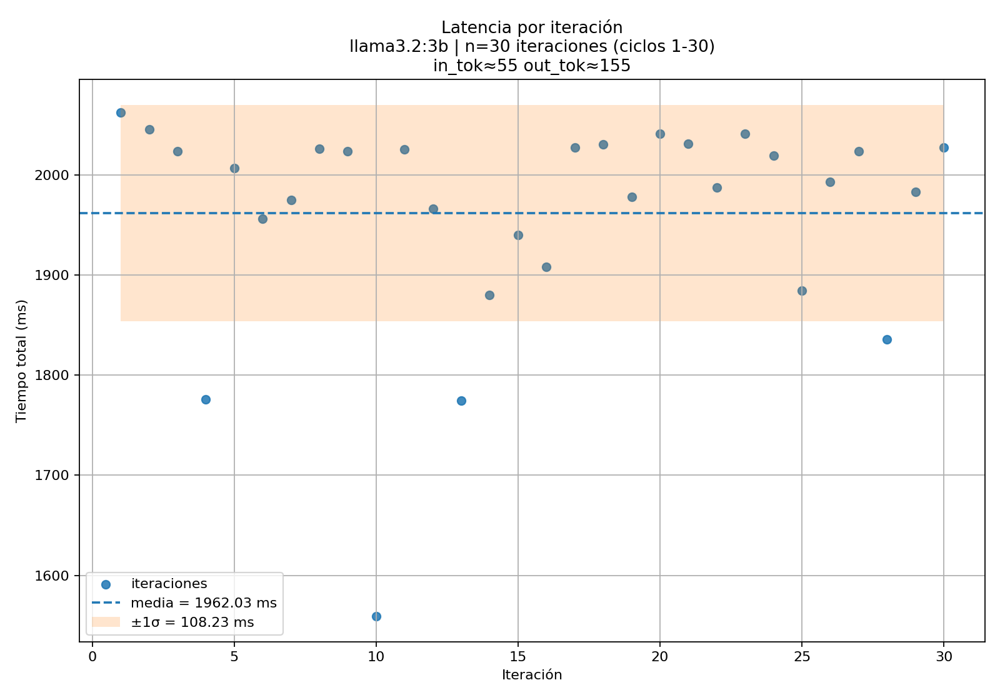

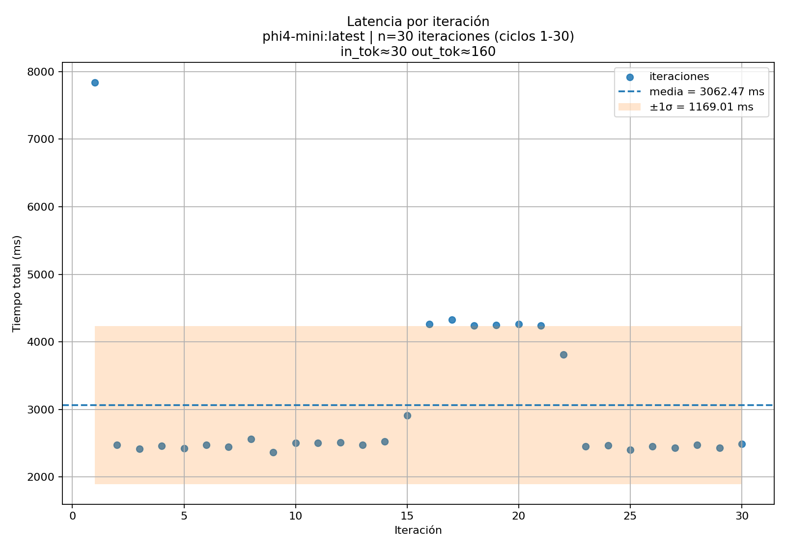

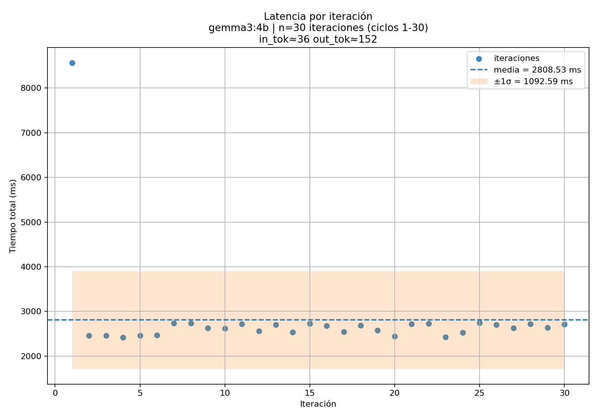

#### Latencia comparada entre los tres modelos

Evolución de la latencia a lo largo de las iteraciones para los tres modelos superpuestos. Los picos en la primera iteración corresponden al `load_duration` de cada modelo.

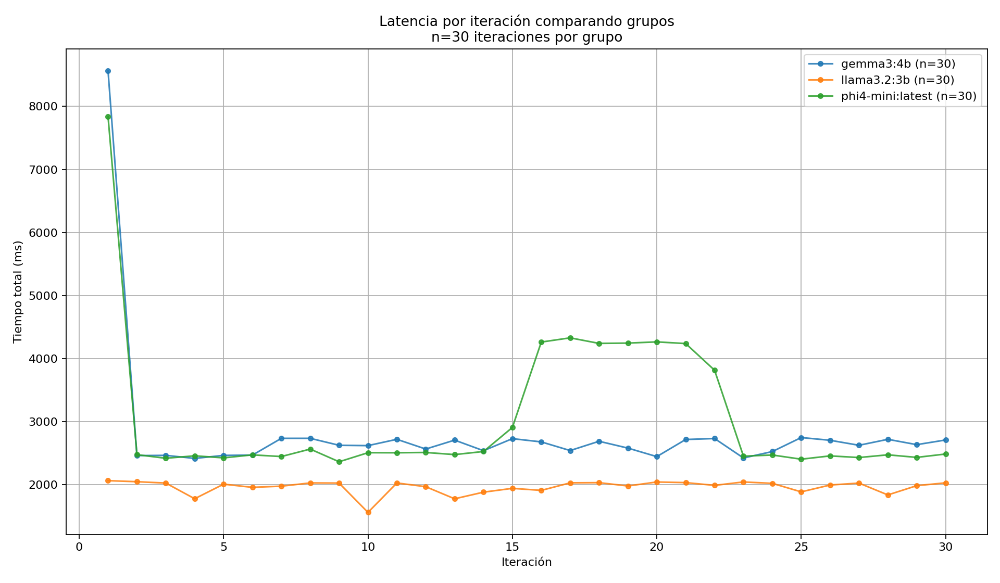

#### Latencia promedio con desviación estándar

Barras de latencia media ± σ ordenadas de menor a mayor. `llama3.2:3b` es el más rápido y el más estable (σ más bajo).

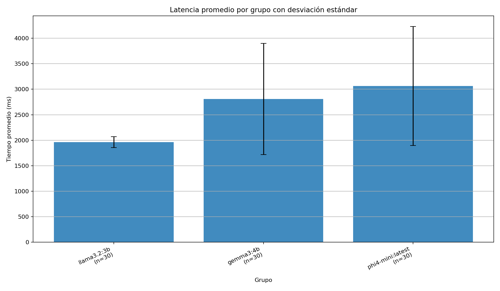

#### Distribución de latencia (boxplot)

Diagrama de caja que muestra mediana, cuartiles y valores atípicos. La alta dispersión de `phi4-mini` y `gemma3:4b` refleja el costo de la primera carga.

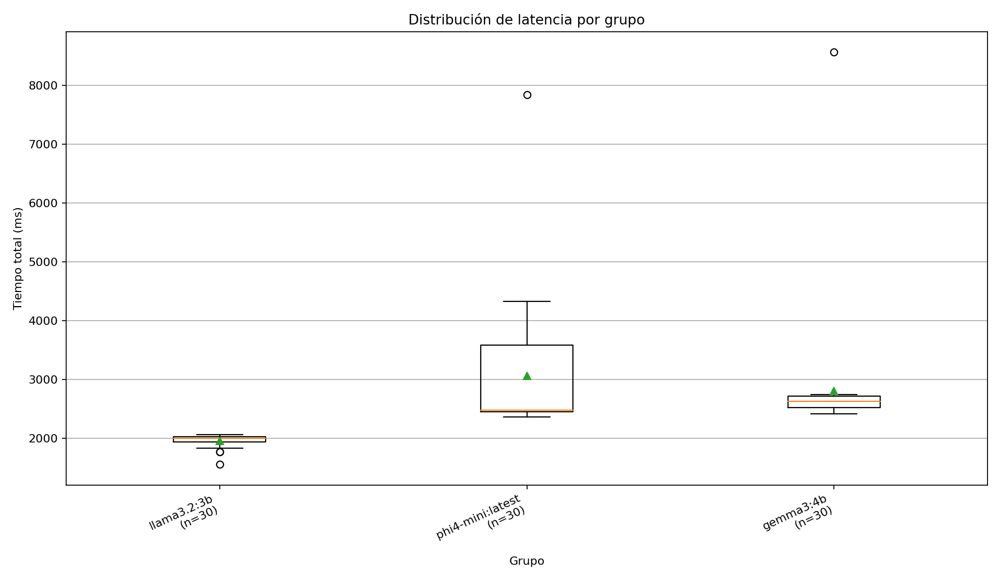

#### Tokens por segundo

Velocidad de generación de tokens de salida a lo largo de las iteraciones.

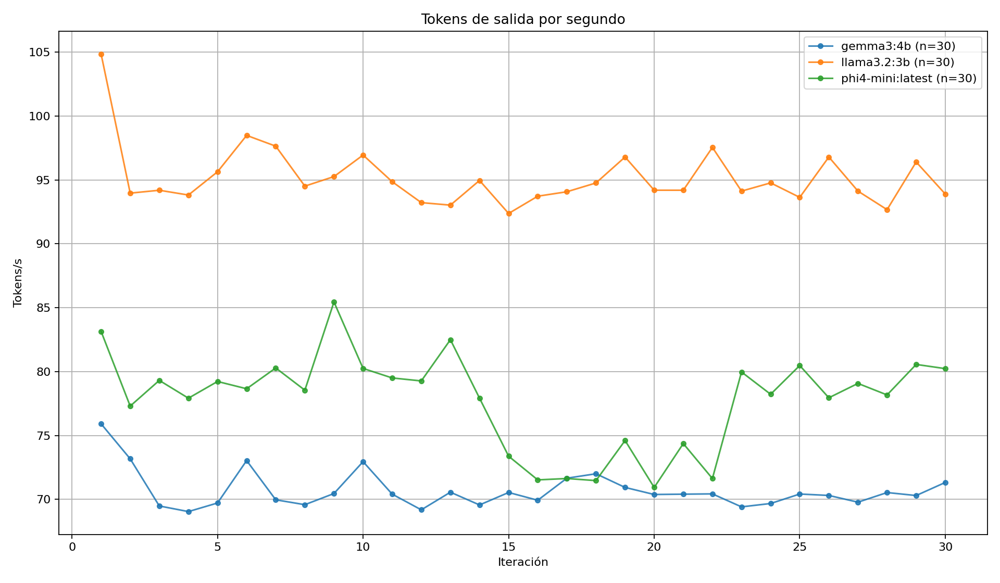

#### Latencia vs. tokens de salida

Relación entre el número de tokens generados y el tiempo total de respuesta.

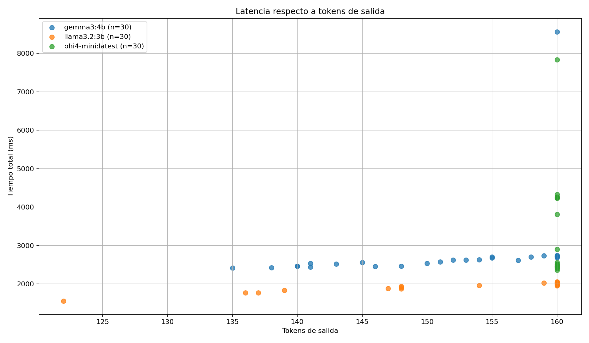

#### Latencia vs. tokens totales (entrada + salida)

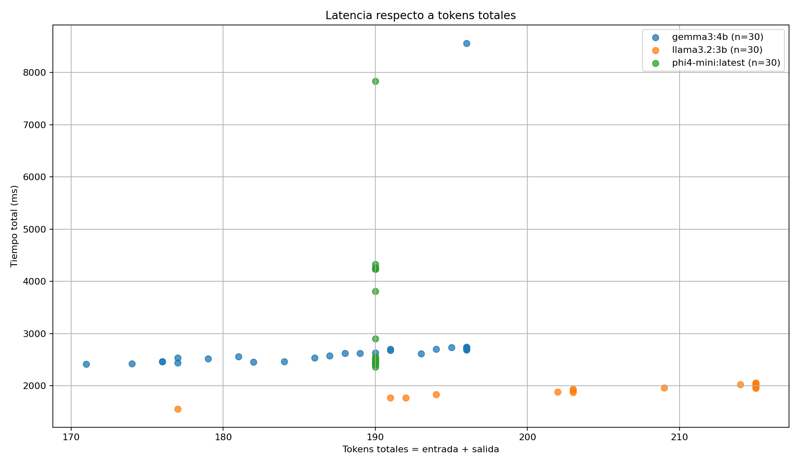

---

### B.3 — Benchmark de variación de parámetros

Script: `benchmark_parametros.py` — 30 ciclos con `llama3.2:3b` variando uno a uno tres parámetros clave, manteniendo el resto en su valor base.

| Parámetro | Valores probados | Base |
|-----------|-----------------|------|
| `temperature` | 0.0 · 0.7 · 1.1 | 0.7 |
| `top_p` | 0.7 · 0.9 · 0.95 | 0.9 |
| `repeat_penalty` | 1.0 · 1.2 · 1.5 | 1.1 |

#### Resumen estadístico por configuración

| Configuración | Latencia media | σ | Tokens salida (media) | Tok/s media |
|--------------|---------------|---|-----------------------|-------------|
| temperature = 0.0 | 2 088 ms | 426 ms | 158.7 | 95.55 |
| temperature = 0.7 | 1 918 ms | 90 ms | 150.2 | 94.42 |
| temperature = 1.1 | 1 938 ms | 88 ms | 153.3 | 95.21 |
| top_p = 0.70 | 1 973 ms | 137 ms | 148.2 | 94.30 |
| top_p = 0.90 | 1 979 ms | 96 ms | 152.4 | 93.87 |
| top_p = 0.95 | 1 926 ms | 111 ms | 149.0 | 93.52 |
| repeat_penalty = 1.0 | 1 895 ms | 79 ms | 150.5 | 91.17 |
| repeat_penalty = 1.2 | 1 937 ms | 108 ms | 153.2 | 94.98 |
| repeat_penalty = 1.5 | 1 660 ms | 256 ms | **126.5** | 92.80 |

> `repeat_penalty=1.5` reduce significativamente la longitud de respuesta (el modelo termina antes al evitar repeticiones), lo que baja la latencia media pero aumenta la desviación estándar.

#### Efecto de `temperature` en la latencia

`temperature=0.0` (determinista) presenta mayor varianza porque en modo determinista el modelo sigue un camino de tokens exacto que puede divergir más ante ruidos internos; `0.7` y `1.1` muestran comportamientos muy similares entre sí.

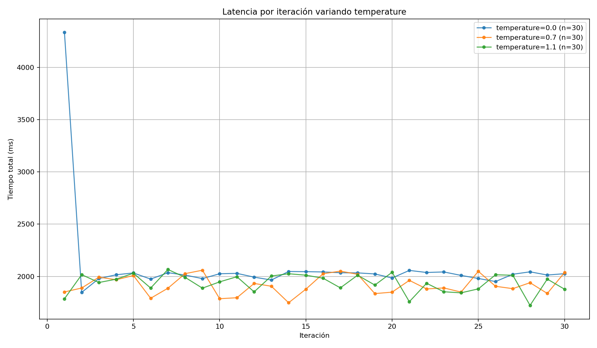

#### Efecto de `top_p` en la latencia

Las tres variaciones de `top_p` producen latencias prácticamente indistinguibles (diferencia máxima de 53 ms en media). El número de tokens candidatos filtrados no impacta el tiempo de generación de manera apreciable en este modelo.

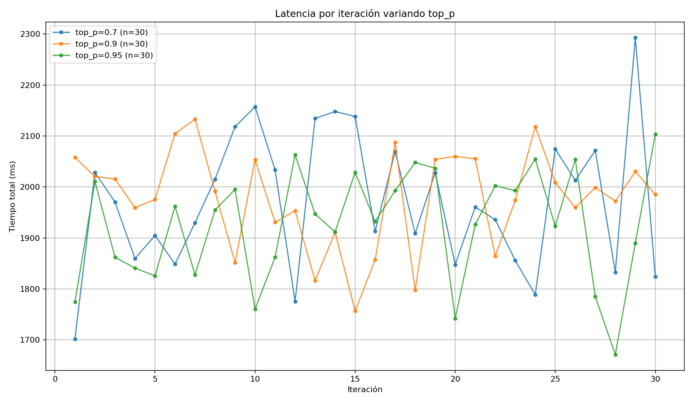

#### Efecto de `repeat_penalty` en la latencia

`repeat_penalty=1.5` es el más llamativo: reduce el tokens de salida promedio de ~152 a ~127 tokens porque el modelo corta la respuesta antes de repetir estructuras. Esto baja la latencia pero produce respuestas más cortas y a veces incompletas.

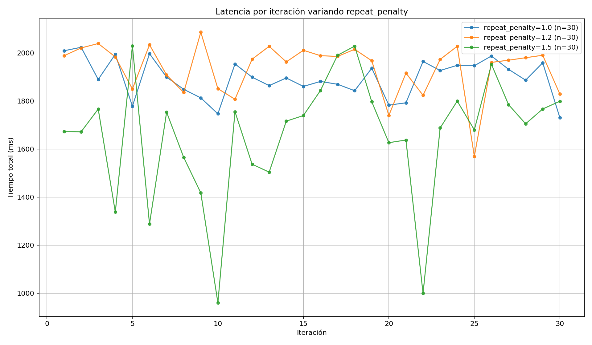

#### Comparativa general de configuraciones de parámetros

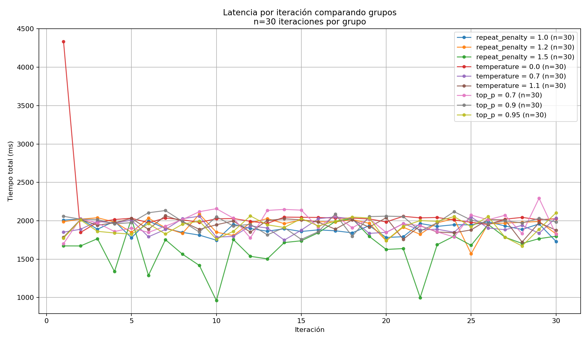

#### Latencia promedio — todas las configuraciones de parámetros

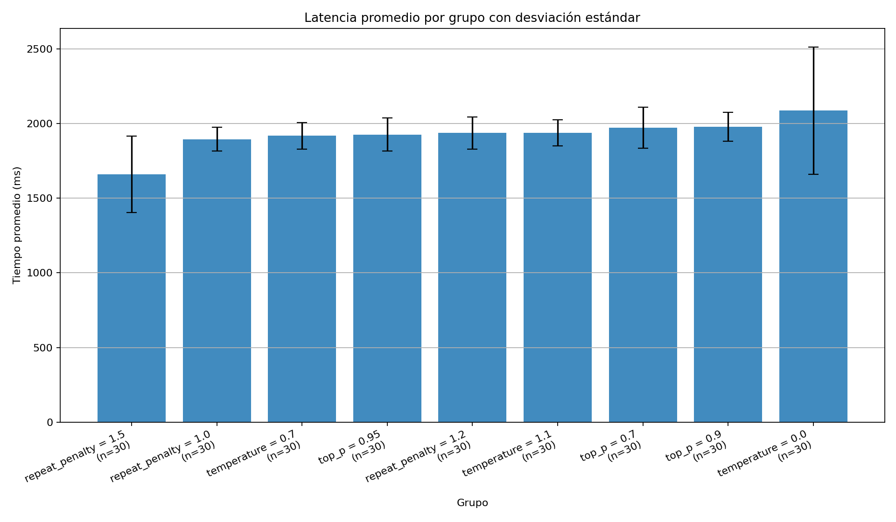

#### Boxplot — distribución por configuración de parámetro

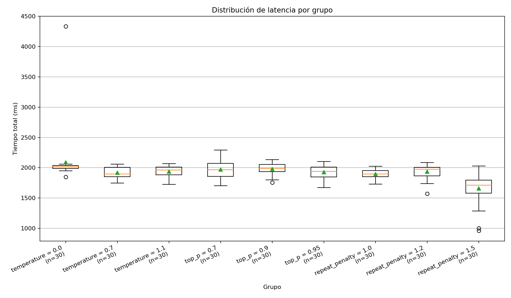

---

### B.4 — Análisis estadístico

Script: `analizar_benchmark.py` — genera `resumen_benchmark_modelos.csv` con medias, desviaciones estándar y valores extremos por modelo.

```
Resumen del benchmark (benchmark_modelos.csv):
──────────────────────────────────────────────────────────────────
Modelo            Lat. media   σ lat.   Tok/s    σ tok/s   Quality
──────────────────────────────────────────────────────────────────
llama3.2:3b       1 962 ms    108 ms   95.19    2.39      10.0
gemma3:4b         2 809 ms   1093 ms   70.70    1.47       9.8
phi4-mini:latest  3 062 ms   1169 ms   77.78    3.73       9.0
──────────────────────────────────────────────────────────────────
```

---

## Reflexión

### ¿Qué diferencia hay entre ejecutar localmente y usar una API en la nube?

| Criterio | Local (Ollama) | Nube (Groq API) |
|----------|---------------|-----------------|
| **Velocidad** | ~95–103 tok/s (GPU integrada) | 300–1 000 tok/s (LPU) |
| **Privacidad** | Total — datos no salen del equipo | Alta — ZDR, SOC 2, GDPR |
| **Costo inicial** | Hardware propio | Cero (free tier) |
| **Costo por token** | Electricidad + amortización | $0.05/M tokens |
| **Disponibilidad** | Sin internet | Requiere conectividad |
| **Tamaño de modelo** | Limitado por RAM/VRAM local | Modelos de 70B+ sin restricción |
| **Control** | Total sobre el modelo | Dependencia del proveedor |

### ¿Cómo afectan los parámetros al rendimiento?

- **`temperature`:** no afecta la latencia de manera sistemática — el modelo genera el mismo número de tokens independientemente del valor. `temperature=0.0` mostró mayor varianza (σ=426 ms), posiblemente por el comportamiento determinista en el muestreo.
- **`top_p`:** impacto mínimo en latencia (diferencia <53 ms en media). El filtro de probabilidad acumulada no añade costo computacional perceptible.
- **`repeat_penalty`:** efecto indirecto — valores altos (`1.5`) hacen que el modelo genere respuestas más cortas (126 vs. 153 tokens), reduciendo la latencia media en ~280 ms pero aumentando la varianza.

### ¿Qué modelo local fue más eficiente?

`llama3.2:3b` ofreció la mejor combinación: menor latencia media (1 962 ms), menor desviación estándar (108 ms) y mayor puntuación de calidad (10/10 en los 30 ciclos). `phi4-mini:latest` generó respuestas más largas (siempre alcanzó el límite de 160 tokens) lo que infló su latencia. `gemma3:4b` tuvo calidad alta (9.8/10) pero latencia media mayor y alta varianza por el costo de carga.

### ¿Por qué la primera iteración es más lenta?

La primera llamada incluye el `load_duration` — tiempo de cargar los pesos del modelo desde disco a memoria. En esta práctica, `llama3.2:3b` tardó 2.37 s en la primera carga. Las iteraciones siguientes no incurren en ese costo porque Ollama mantiene el modelo en memoria según `keep_alive`. Este efecto es claramente visible en los scatter plots como un pico aislado en la iteración 1.
