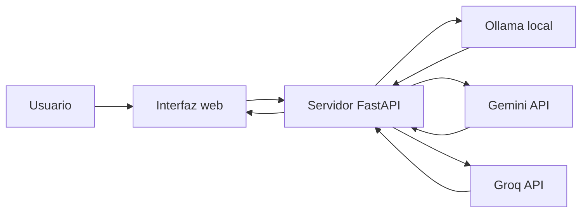
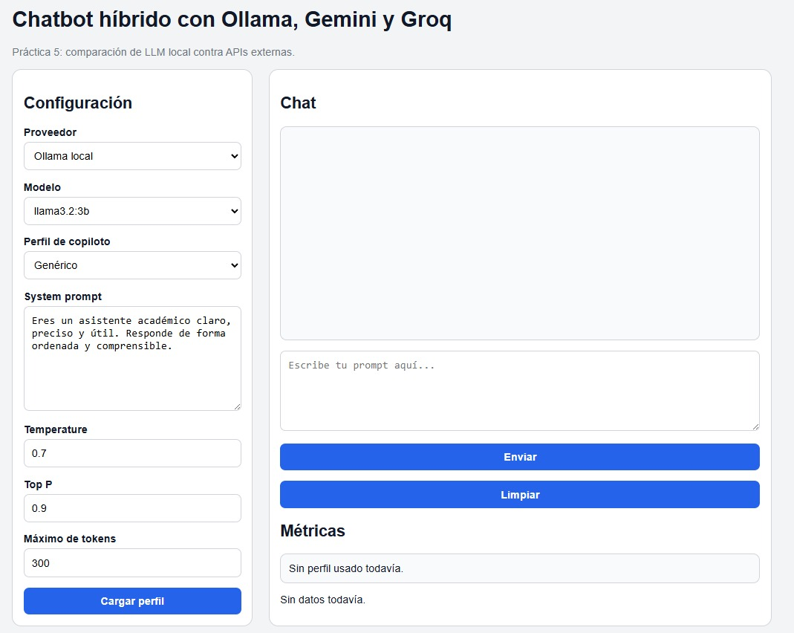
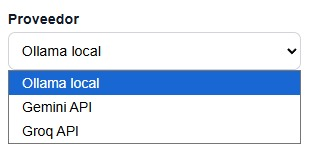
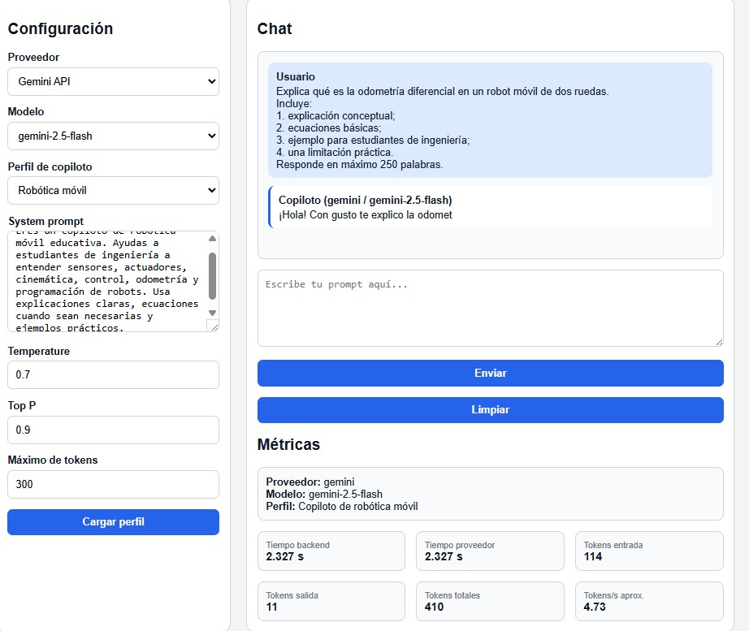
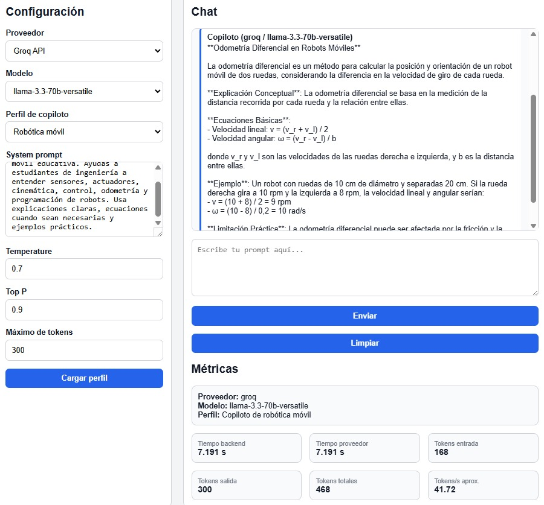
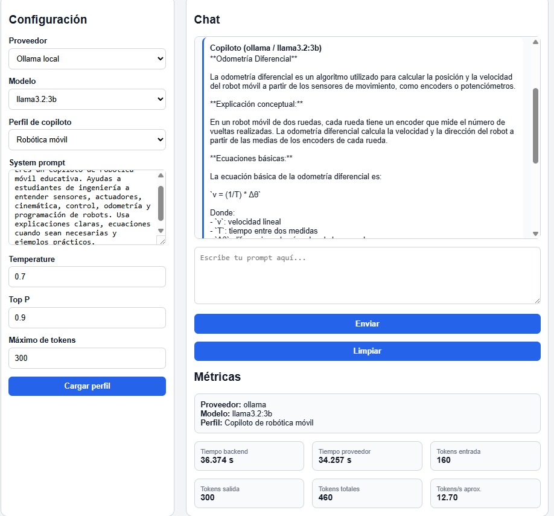

# Práctica 5: APIs externas (LLM en la nube)

**Herramientas:** Ollama · Gemini API · Groq API · FastAPI · HTML · CSS · JavaScript
{: .label .label-blue }

---

## Introducción

En esta práctica se desarrolló un **chatbot híbrido** capaz de conectarse con diferentes proveedores de modelos de lenguaje. El objetivo central de la práctica es el **consumo de APIs externas de IA en la nube**: comparar un modelo ejecutado de forma local mediante **Ollama** contra modelos remotos consumidos por API, específicamente **Gemini API** (Google) y **Groq API**.

El sistema permite seleccionar el proveedor, el modelo y los parámetros de generación (`temperature`, `top_p`, `max_tokens`) desde una misma interfaz, de modo que se puede analizar cómo cambian la **latencia**, los **tokens generados** y la **velocidad** según el proveedor utilizado.

> Esta práctica es la base didáctica de lo que el proyecto **LadderVoice** ya hace en producción: consumir un LLM en la nube (Groq) desde un backend en Render. Ver la [Práctica 3 — Sistema conectado](sistema-conectado) para la arquitectura completa del proyecto.

---

## Objetivos

- Consumir modelos de lenguaje a través de **APIs externas en la nube** (Gemini y Groq).
- Conectar también un modelo **local** con Ollama para comparar contra la nube.
- Gestionar **claves de API** y **variables de entorno** de forma segura (`.env`).
- Medir y comparar **tiempo de respuesta**, **tokens generados** y **velocidad de generación**.
- Analizar ventajas y desventajas de usar modelos locales frente a APIs externas (latencia, costo, privacidad, *rate limits*).

---

## Marco teórico: local vs. nube

| Aspecto | Modelo local (Ollama) | API externa (Gemini / Groq) |
|--------|-----------------------|------------------------------|
| Dónde corre el modelo | En tu propia máquina | En los servidores del proveedor |
| Requiere internet | No | Sí |
| Requiere API key | No | Sí |
| Costo | Solo tu hardware/luz | Por token (con *free tier* limitado) |
| Privacidad | Alta (nada sale de tu red) | Depende del proveedor |
| Límite de uso | Tu GPU/CPU | *Rate limits* (p. ej. tokens/min) |
| Tamaño de modelo | Limitado por tu RAM/VRAM | Modelos muy grandes disponibles |

**Claves de API y variables de entorno.** Las APIs externas requieren autenticación con una clave secreta. Esa clave **nunca** debe ir escrita en el código del frontend (sería visible para cualquiera en el navegador): se guarda como variable de entorno en el backend (archivo `.env` en local, *Environment Variables* en Render). Por eso el backend actúa como intermediario obligado entre el navegador y la API de IA.

**Rate limits.** Los planes gratuitos imponen límites (por ejemplo, Groq limita a unos 8 000 tokens por minuto en su *tier* gratuito). Superarlos devuelve un error `429 Too Many Requests`, por lo que conviene controlar el volumen de peticiones.

---

## Arquitectura general del sistema

El sistema se organizó mediante una interfaz web conectada a un servidor en Python. El usuario interactúa con una página web, selecciona el proveedor y envía un prompt. Después, el backend recibe la solicitud, identifica el proveedor seleccionado y llama al modelo correspondiente.



Esta arquitectura permite probar distintos modelos desde una misma interfaz, sin tener que modificar manualmente el código cada vez que se desea cambiar de proveedor.

---

## Interfaz principal del chatbot

La interfaz contiene una sección de configuración y una sección de conversación. En la configuración se elige el proveedor, el modelo y los parámetros de generación.



---

## Selección de proveedor y modelo

El sistema permite seleccionar entre tres proveedores principales. Cada proveedor tiene asociado uno o más modelos:

| Proveedor | Modelo utilizado | Tipo |
|----------|------------------|------|
| Ollama local | `llama3.2:3b` | Local |
| Gemini API | `gemini-2.5-flash` | Remoto (nube) |
| Groq API | `llama-3.3-70b-versatile` | Remoto (nube) |



> La **configuración de perfiles de copiloto y `system_prompt`** que también ofrece esta interfaz se documenta en la [Práctica 4 — Copiloto especializado](practica-4); aquí el foco es el consumo de las APIs externas.

---

## Prompt utilizado para las pruebas

Para comparar los proveedores se utilizó el **mismo prompt** en los tres, manteniendo fijos los parámetros de generación:

```text
Explica qué es la odometría diferencial en un robot móvil de dos ruedas.
Incluye:
1. explicación conceptual;
2. ecuaciones básicas;
3. ejemplo para estudiantes de ingeniería;
4. una limitación práctica.
Responde en máximo 250 palabras.
```

| Parámetro | Valor |
|----------|-------|
| Temperature | `0.7` |
| Top P | `0.9` |
| Máximo de tokens | `300` |
| Perfil | Robótica móvil |

---

## Prueba con Gemini API

Primera prueba con **Gemini API** (`gemini-2.5-flash`). La respuesta fue rápida, aunque la salida generada quedó corta respecto a las otras pruebas.



| Métrica | Valor |
|--------|------:|
| Tiempo backend | 2.327 s |
| Tiempo proveedor | 2.327 s |
| Tokens entrada | 114 |
| Tokens salida | 11 |
| Tokens totales | 410 |
| Tokens/s aprox. | 4.73 |

---

## Prueba con Groq API

Segunda prueba con **Groq API** (`llama-3.3-70b-versatile`). La respuesta fue más extensa y estructurada, incluyendo explicación conceptual, ecuaciones, ejemplo y limitación práctica.



| Métrica | Valor |
|--------|------:|
| Tiempo backend | 7.191 s |
| Tiempo proveedor | 7.191 s |
| Tokens entrada | 168 |
| Tokens salida | 300 |
| Tokens totales | 468 |
| Tokens/s aprox. | 41.72 |

---

## Prueba con Ollama local

Tercera prueba con **Ollama local** (`llama3.2:3b`). No dependió de una API externa: el modelo se ejecutó directamente en la computadora. El tiempo de respuesta fue mayor que en los proveedores remotos.



| Métrica | Valor |
|--------|------:|
| Tiempo backend | 36.374 s |
| Tiempo proveedor | 34.257 s |
| Tokens entrada | 160 |
| Tokens salida | 300 |
| Tokens totales | 460 |
| Tokens/s aprox. | 12.70 |

---

## Comparación de resultados

| Criterio | Ollama local | Gemini API | Groq API |
|---------|--------------|------------|----------|
| Modelo | `llama3.2:3b` | `gemini-2.5-flash` | `llama-3.3-70b-versatile` |
| Tipo de ejecución | Local | Remota | Remota |
| Requiere internet | No | Sí | Sí |
| Requiere API key | No | Sí | Sí |
| Tiempo backend | 36.374 s | 2.327 s | 7.191 s |
| Tokens entrada | 160 | 114 | 168 |
| Tokens salida | 300 | 11 | 300 |
| Tokens totales | 460 | 410 | 468 |
| Tokens/s aprox. | 12.70 | 4.73 | 41.72 |
| Privacidad | Alta | Depende del proveedor | Depende del proveedor |

---

## Evaluación cualitativa

| Criterio | Ollama local | Gemini API | Groq API |
|---------|-------------:|-----------:|---------:|
| Claridad conceptual | 4 | 2 | 5 |
| Precisión técnica | 3 | 2 | 4 |
| Uso de ecuaciones | 3 | 1 | 4 |
| Calidad del ejemplo | 3 | 1 | 4 |
| Nivel para ingeniería | 4 | 2 | 5 |
| Identificación de limitaciones | 3 | 1 | 4 |
| Utilidad final | 4 | 2 | 5 |

En esta ejecución, Groq ofreció la respuesta más completa y estructurada. Ollama también generó una respuesta útil, aunque con mayor tiempo de espera. Gemini fue el proveedor más rápido en esta prueba, pero la respuesta visible quedó incompleta, por lo que su evaluación cualitativa fue menor.

---

## Aplicación al proyecto: APIs externas en LadderVoice

El proyecto **LadderVoice** lleva esta práctica a producción: el frontend (GitHub Pages) no llama nunca a la IA directamente —eso expondría la API key—, sino que delega en un backend FastAPI desplegado en **Render**, el cual consume **APIs externas de Groq** para todo el procesamiento:

| Función en LadderVoice | API externa usada | Modelo |
|------------------------|-------------------|--------|
| Generación de lógica ladder | Groq (Chat Completions) | `openai/gpt-oss-120b` |
| Transcripción de voz (STT) | Groq (Audio) | `whisper-large-v3` |
| Lectura de PDFs de referencia (Vision) | Groq (Vision) | `meta-llama/llama-4-scout-17b-16e-instruct` |

Las claves viven como variables de entorno en Render (`GROQ_API_KEY`, `GROQ_API_KEY_stt`), y el backend gestiona los *rate limits* del *free tier* con reintentos y reducción de `max_tokens`. La arquitectura completa de tres capas (GitHub Pages → Render → Groq) se detalla en la [Práctica 3 — Sistema conectado](sistema-conectado).

---

# Código utilizado

A continuación se muestra el código del chatbot híbrido de la práctica. Se incluyen los archivos principales: backend, frontend, estilos y dependencias.

---

## Archivo `main.py`

```python
import os
import time
from typing import Dict, List, Optional

import requests
from dotenv import load_dotenv
from fastapi import FastAPI, HTTPException
from fastapi.middleware.cors import CORSMiddleware
from pydantic import BaseModel, Field

from google import genai
from google.genai import types
from openai import OpenAI


# =====================================================
# CONFIGURACIÓN
# =====================================================

load_dotenv()

GEMINI_API_KEY = os.getenv("GEMINI_API_KEY")
GROQ_API_KEY = os.getenv("GROQ_API_KEY")

OLLAMA_URL = "http://localhost:11434/api/chat"


# =====================================================
# PERFILES DE COPILOTO
# =====================================================

COPILOT_PROFILES: Dict[str, Dict[str, str]] = {
    "generico": {
        "label": "Asistente genérico",
        "system_prompt": (
            "Eres un asistente académico claro, preciso y útil. "
            "Responde de forma ordenada y comprensible."
        ),
    },
    "robotica": {
        "label": "Copiloto de robótica móvil",
        "system_prompt": (
            "Eres un copiloto de robótica móvil educativa. "
            "Ayudas a estudiantes de ingeniería a entender sensores, actuadores, "
            "cinemática, control, odometría y programación de robots. "
            "Usa explicaciones claras, ecuaciones cuando sean necesarias y ejemplos prácticos."
        ),
    },
    "programacion": {
        "label": "Copiloto de programación Python",
        "system_prompt": (
            "Eres un copiloto de programación en Python. "
            "Explicas paso a paso, propones código claro y corriges errores de manera verificable."
        ),
    },
}


# =====================================================
# PROVEEDORES Y MODELOS
# =====================================================

PROVIDER_MODELS = {
    "ollama": [
        "llama3.2:3b",
    ],
    "gemini": [
        "gemini-2.5-flash",
    ],
    "groq": [
        "llama-3.3-70b-versatile",
        "llama-3.1-8b-instant",
    ],
}


# =====================================================
# FASTAPI
# =====================================================

app = FastAPI(
    title="Chatbot híbrido con Ollama y APIs externas",
    version="1.0.0",
)

app.add_middleware(
    CORSMiddleware,
    allow_origins=[
        "http://localhost:5500",
        "http://127.0.0.1:5500",
    ],
    allow_credentials=True,
    allow_methods=["*"],
    allow_headers=["*"],
)


# =====================================================
# MODELOS DE DATOS
# =====================================================

class ChatRequest(BaseModel):
    message: str = Field(..., min_length=1, max_length=4000)
    provider: str = Field(default="ollama")
    model: str = Field(default="llama3.2:3b")
    copilot_profile: str = Field(default="generico")
    system_prompt: str = Field(default="")
    temperature: float = Field(default=0.7, ge=0.0, le=1.2)
    top_p: float = Field(default=0.9, ge=0.1, le=1.0)
    max_tokens: int = Field(default=300, ge=20, le=1000)


class ChatMetrics(BaseModel):
    wall_time_s: float
    provider_duration_s: float
    prompt_tokens: int
    completion_tokens: int
    total_tokens: int
    tokens_per_second: float
    raw_provider_metrics: Optional[dict] = None


class ChatResponse(BaseModel):
    provider: str
    model: str
    copilot_profile: str
    copilot_label: str
    system_prompt_used: str
    reply: str
    metrics: ChatMetrics


# =====================================================
# ENDPOINTS BASE
# =====================================================

@app.get("/")
def root():
    return {
        "message": "API de chatbot híbrido funcionando",
        "docs": "/docs",
        "health": "/health",
        "profiles": "/profiles",
        "providers": "/providers",
    }


@app.get("/health")
def health():
    return {"status": "ok"}


@app.get("/profiles")
def profiles():
    return COPILOT_PROFILES


@app.get("/providers")
def providers():
    return PROVIDER_MODELS


# =====================================================
# FUNCIONES AUXILIARES
# =====================================================

def validate_provider(provider: str) -> str:
    provider = provider.lower().strip()

    if provider not in PROVIDER_MODELS:
        raise HTTPException(
            status_code=400,
            detail=f"Proveedor no válido: {provider}",
        )

    return provider


def validate_model(provider: str, model: str) -> str:
    model = model.strip()

    if model not in PROVIDER_MODELS[provider]:
        raise HTTPException(
            status_code=400,
            detail=f"Modelo no válido para {provider}: {model}",
        )

    return model


def get_system_prompt(request: ChatRequest) -> tuple[str, str]:
    profile_id = request.copilot_profile

    if profile_id not in COPILOT_PROFILES:
        raise HTTPException(
            status_code=400,
            detail=f"Perfil no válido: {profile_id}",
        )

    profile = COPILOT_PROFILES[profile_id]

    if request.system_prompt.strip():
        system_prompt = request.system_prompt.strip()
    else:
        system_prompt = profile["system_prompt"]

    return system_prompt, profile["label"]


def build_messages(system_prompt: str, user_message: str) -> List[Dict[str, str]]:
    return [
        {
            "role": "system",
            "content": system_prompt,
        },
        {
            "role": "user",
            "content": user_message,
        },
    ]


# =====================================================
# LLAMADA A OLLAMA
# =====================================================

def call_ollama(request: ChatRequest, messages: List[Dict[str, str]]) -> tuple[str, ChatMetrics]:
    payload = {
        "model": request.model,
        "messages": messages,
        "stream": False,
        "options": {
            "temperature": request.temperature,
            "top_p": request.top_p,
            "num_predict": request.max_tokens,
        },
    }

    start = time.perf_counter()

    try:
        response = requests.post(OLLAMA_URL, json=payload, timeout=300)
        response.raise_for_status()
    except requests.exceptions.ConnectionError:
        raise HTTPException(
            status_code=503,
            detail="No se pudo conectar con Ollama. Verifica que Ollama esté instalado y ejecutándose.",
        )
    except requests.exceptions.HTTPError as error:
        raise HTTPException(
            status_code=500,
            detail=f"Error de Ollama: {error}",
        )

    end = time.perf_counter()

    data = response.json()

    reply = data.get("message", {}).get("content", "")

    prompt_tokens = data.get("prompt_eval_count", 0)
    completion_tokens = data.get("eval_count", 0)
    total_tokens = prompt_tokens + completion_tokens

    provider_duration_s = data.get("total_duration", 0) / 1e9
    wall_time_s = end - start

    tokens_per_second = 0.0
    eval_duration_s = data.get("eval_duration", 0) / 1e9

    if eval_duration_s > 0 and completion_tokens > 0:
        tokens_per_second = completion_tokens / eval_duration_s

    metrics = ChatMetrics(
        wall_time_s=wall_time_s,
        provider_duration_s=provider_duration_s,
        prompt_tokens=prompt_tokens,
        completion_tokens=completion_tokens,
        total_tokens=total_tokens,
        tokens_per_second=tokens_per_second,
        raw_provider_metrics=data,
    )

    return reply, metrics


# =====================================================
# LLAMADA A GEMINI
# =====================================================

def call_gemini(request: ChatRequest, system_prompt: str) -> tuple[str, ChatMetrics]:
    if not GEMINI_API_KEY:
        raise HTTPException(
            status_code=500,
            detail="Falta GEMINI_API_KEY en el archivo .env",
        )

    client = genai.Client(api_key=GEMINI_API_KEY)

    start = time.perf_counter()

    try:
        response = client.models.generate_content(
            model=request.model,
            contents=request.message,
            config=types.GenerateContentConfig(
                system_instruction=system_prompt,
                temperature=request.temperature,
                top_p=request.top_p,
                max_output_tokens=request.max_tokens,
            ),
        )
    except Exception as error:
        raise HTTPException(
            status_code=500,
            detail=f"Error llamando a Gemini: {error}",
        )

    end = time.perf_counter()

    reply = response.text or ""

    usage = getattr(response, "usage_metadata", None)

    prompt_tokens = getattr(usage, "prompt_token_count", 0) if usage else 0
    completion_tokens = getattr(usage, "candidates_token_count", 0) if usage else 0
    total_tokens = getattr(usage, "total_token_count", 0) if usage else 0

    wall_time_s = end - start

    tokens_per_second = 0.0
    if wall_time_s > 0 and completion_tokens > 0:
        tokens_per_second = completion_tokens / wall_time_s

    metrics = ChatMetrics(
        wall_time_s=wall_time_s,
        provider_duration_s=wall_time_s,
        prompt_tokens=prompt_tokens,
        completion_tokens=completion_tokens,
        total_tokens=total_tokens,
        tokens_per_second=tokens_per_second,
        raw_provider_metrics={
            "prompt_tokens": prompt_tokens,
            "completion_tokens": completion_tokens,
            "total_tokens": total_tokens,
        },
    )

    return reply, metrics


# =====================================================
# LLAMADA A GROQ
# =====================================================

def call_groq(request: ChatRequest, messages: List[Dict[str, str]]) -> tuple[str, ChatMetrics]:
    if not GROQ_API_KEY:
        raise HTTPException(
            status_code=500,
            detail="Falta GROQ_API_KEY en el archivo .env",
        )

    client = OpenAI(
        api_key=GROQ_API_KEY,
        base_url="https://api.groq.com/openai/v1",
    )

    start = time.perf_counter()

    try:
        completion = client.chat.completions.create(
            model=request.model,
            messages=messages,
            temperature=request.temperature,
            top_p=request.top_p,
            max_tokens=request.max_tokens,
        )
    except Exception as error:
        raise HTTPException(
            status_code=500,
            detail=f"Error llamando a Groq: {error}",
        )

    end = time.perf_counter()

    reply = completion.choices[0].message.content or ""

    usage = completion.usage

    prompt_tokens = usage.prompt_tokens if usage else 0
    completion_tokens = usage.completion_tokens if usage else 0
    total_tokens = usage.total_tokens if usage else 0

    wall_time_s = end - start

    tokens_per_second = 0.0
    if wall_time_s > 0 and completion_tokens > 0:
        tokens_per_second = completion_tokens / wall_time_s

    metrics = ChatMetrics(
        wall_time_s=wall_time_s,
        provider_duration_s=wall_time_s,
        prompt_tokens=prompt_tokens,
        completion_tokens=completion_tokens,
        total_tokens=total_tokens,
        tokens_per_second=tokens_per_second,
        raw_provider_metrics={
            "prompt_tokens": prompt_tokens,
            "completion_tokens": completion_tokens,
            "total_tokens": total_tokens,
        },
    )

    return reply, metrics


# =====================================================
# ENDPOINT PRINCIPAL
# =====================================================

@app.post("/chat", response_model=ChatResponse)
def chat(request: ChatRequest):
    provider = validate_provider(request.provider)
    model = validate_model(provider, request.model)

    system_prompt, copilot_label = get_system_prompt(request)
    messages = build_messages(system_prompt, request.message)

    if provider == "ollama":
        reply, metrics = call_ollama(request, messages)

    elif provider == "gemini":
        reply, metrics = call_gemini(request, system_prompt)

    elif provider == "groq":
        reply, metrics = call_groq(request, messages)

    else:
        raise HTTPException(
            status_code=400,
            detail="Proveedor no implementado.",
        )

    return ChatResponse(
        provider=provider,
        model=model,
        copilot_profile=request.copilot_profile,
        copilot_label=copilot_label,
        system_prompt_used=system_prompt,
        reply=reply,
        metrics=metrics,
    )
```

---

## Archivo `index.html`

```html
<!DOCTYPE html>
<html lang="es">
<head>
  <meta charset="UTF-8" />
  <meta name="viewport" content="width=device-width, initial-scale=1.0" />
  <title>Chatbot híbrido con APIs externas</title>
  <link rel="stylesheet" href="styles.css" />
</head>
<body>

  <main class="container">
    <h1>Chatbot híbrido con Ollama, Gemini y Groq</h1>
    <p class="subtitle">
      Práctica 5: comparación de LLM local contra APIs externas.
    </p>

    <section class="layout">

      <aside class="panel">
        <h2>Configuración</h2>

        <label for="provider">Proveedor</label>
        <select id="provider">
          <option value="ollama">Ollama local</option>
          <option value="gemini">Gemini API</option>
          <option value="groq">Groq API</option>
        </select>

        <label for="model">Modelo</label>
        <select id="model"></select>

        <label for="copilot_profile">Perfil de copiloto</label>
        <select id="copilot_profile">
          <option value="generico">Genérico</option>
          <option value="robotica">Robótica móvil</option>
          <option value="programacion">Programación Python</option>
        </select>

        <label for="system_prompt">System prompt</label>
        <textarea id="system_prompt" rows="7"></textarea>

        <label for="temperature">Temperature</label>
        <input id="temperature" type="number" step="0.1" min="0" max="1.2" value="0.7" />

        <label for="top_p">Top P</label>
        <input id="top_p" type="number" step="0.1" min="0.1" max="1" value="0.9" />

        <label for="max_tokens">Máximo de tokens</label>
        <input id="max_tokens" type="number" min="20" max="1000" value="300" />

        <button id="loadProfileBtn" type="button">
          Cargar perfil
        </button>
      </aside>

      <section class="chat-panel">
        <h2>Chat</h2>

        <div id="chat" class="chat"></div>

        <form id="chatForm" class="chat-form">
          <textarea id="message" rows="5" placeholder="Escribe tu prompt aquí..."></textarea>
          <button id="sendBtn" type="submit">Enviar</button>
          <button id="clearBtn" type="button">Limpiar</button>
        </form>

        <h2>Métricas</h2>
        <div id="profileInfo" class="profile-info">
          Sin perfil usado todavía.
        </div>

        <div id="metricsGrid" class="metrics-grid">
          <span>Sin datos todavía.</span>
        </div>
      </section>

    </section>
  </main>

  <script src="app.js"></script>
</body>
</html>
```

---

## Archivo `styles.css`

```css
:root {
  --bg: #f3f4f6;
  --card: #ffffff;
  --text: #111827;
  --muted: #6b7280;
  --border: #d1d5db;
  --blue: #2563eb;
  --error: #f59e0b;
}

* {
  box-sizing: border-box;
}

body {
  margin: 0;
  font-family: Arial, sans-serif;
  background: var(--bg);
  color: var(--text);
}

.container {
  max-width: 1200px;
  margin: 0 auto;
  padding: 2rem;
}

.subtitle {
  color: var(--muted);
}

.layout {
  display: grid;
  grid-template-columns: 360px 1fr;
  gap: 1.5rem;
}

.panel,
.chat-panel {
  background: var(--card);
  border: 1px solid var(--border);
  border-radius: 14px;
  padding: 1rem;
}

label {
  display: block;
  margin-top: 1rem;
  margin-bottom: 0.35rem;
  font-weight: bold;
}

select,
textarea,
input,
button {
  width: 100%;
  padding: 0.7rem;
  border: 1px solid var(--border);
  border-radius: 8px;
  font-size: 1rem;
}

textarea {
  resize: vertical;
}

button {
  margin-top: 1rem;
  background: var(--blue);
  color: white;
  border: none;
  cursor: pointer;
  font-weight: bold;
}

button:disabled {
  opacity: 0.6;
  cursor: not-allowed;
}

.chat {
  min-height: 320px;
  max-height: 420px;
  overflow-y: auto;
  background: #f9fafb;
  border: 1px solid var(--border);
  border-radius: 10px;
  padding: 1rem;
}

.message {
  padding: 0.75rem;
  border-radius: 10px;
  margin-bottom: 0.75rem;
  white-space: pre-wrap;
}

.message.user {
  background: #dbeafe;
}

.message.assistant {
  background: #ffffff;
  border-left: 4px solid var(--blue);
}

.message.error {
  background: #fef3c7;
  border-left: 4px solid var(--error);
}

.message strong {
  display: block;
  margin-bottom: 0.25rem;
}

.chat-form {
  margin-top: 1rem;
}

.profile-info {
  margin-bottom: 1rem;
  padding: 0.75rem;
  background: #f9fafb;
  border: 1px solid var(--border);
  border-radius: 10px;
}

.metrics-grid {
  display: grid;
  grid-template-columns: repeat(3, 1fr);
  gap: 1rem;
}

.metric-card {
  background: #f9fafb;
  border: 1px solid var(--border);
  border-radius: 10px;
  padding: 0.75rem;
}

.metric-card small {
  display: block;
  color: var(--muted);
}

.metric-card strong {
  font-size: 1.1rem;
}

@media (max-width: 900px) {
  .layout {
    grid-template-columns: 1fr;
  }

  .metrics-grid {
    grid-template-columns: 1fr;
  }
}
```

---

## Archivo `app.js`

```javascript
const API_URL = "http://localhost:8000/chat";
const PROFILES_URL = "http://localhost:8000/profiles";
const PROVIDERS_URL = "http://localhost:8000/providers";

const form = document.getElementById("chatForm");
const chat = document.getElementById("chat");
const metricsGrid = document.getElementById("metricsGrid");
const profileInfo = document.getElementById("profileInfo");

const sendBtn = document.getElementById("sendBtn");
const clearBtn = document.getElementById("clearBtn");
const loadProfileBtn = document.getElementById("loadProfileBtn");

const messageInput = document.getElementById("message");
const systemPromptInput = document.getElementById("system_prompt");
const profileSelect = document.getElementById("copilot_profile");
const providerSelect = document.getElementById("provider");
const modelSelect = document.getElementById("model");

let profiles = {};
let providerModels = {};


async function loadProfiles() {
  try {
    const response = await fetch(PROFILES_URL);

    if (!response.ok) {
      throw new Error("No se pudieron cargar los perfiles.");
    }

    profiles = await response.json();
    loadSelectedProfile();

  } catch (error) {
    console.error(error);
    systemPromptInput.value = "Error cargando perfiles desde el backend.";
  }
}


async function loadProviders() {
  try {
    const response = await fetch(PROVIDERS_URL);

    if (!response.ok) {
      throw new Error("No se pudieron cargar los proveedores.");
    }

    providerModels = await response.json();
    renderModelOptions();

  } catch (error) {
    console.error(error);
    modelSelect.innerHTML = `<option>Error cargando modelos</option>`;
  }
}


function renderModelOptions() {
  const provider = providerSelect.value;
  const models = providerModels[provider] || [];

  modelSelect.innerHTML = models
    .map(model => `<option value="${escapeHtml(model)}">${escapeHtml(model)}</option>`)
    .join("");
}


function loadSelectedProfile() {
  const profileId = profileSelect.value;

  if (profiles[profileId]) {
    systemPromptInput.value = profiles[profileId].system_prompt;
  }
}


function getConfig() {
  return {
    provider: providerSelect.value,
    model: modelSelect.value,
    copilot_profile: profileSelect.value,
    system_prompt: systemPromptInput.value,
    temperature: Number(document.getElementById("temperature").value),
    top_p: Number(document.getElementById("top_p").value),
    max_tokens: Number(document.getElementById("max_tokens").value),
  };
}


function addMessage(role, content, type = "assistant") {
  const div = document.createElement("div");
  div.className = `message ${type}`;
  div.innerHTML = `<strong>${escapeHtml(role)}</strong>${escapeHtml(content)}`;
  chat.appendChild(div);
  chat.scrollTop = chat.scrollHeight;
}


function renderMetrics(data) {
  const metrics = data.metrics;

  profileInfo.innerHTML = `
    <strong>Proveedor:</strong> ${escapeHtml(data.provider)}
    <br>
    <strong>Modelo:</strong> ${escapeHtml(data.model)}
    <br>
    <strong>Perfil:</strong> ${escapeHtml(data.copilot_label)}
  `;

  const items = [
    ["Tiempo backend", `${metrics.wall_time_s.toFixed(3)} s`],
    ["Tiempo proveedor", `${metrics.provider_duration_s.toFixed(3)} s`],
    ["Tokens entrada", metrics.prompt_tokens],
    ["Tokens salida", metrics.completion_tokens],
    ["Tokens totales", metrics.total_tokens],
    ["Tokens/s aprox.", metrics.tokens_per_second.toFixed(2)],
  ];

  metricsGrid.innerHTML = items
    .map(([label, value]) => `
      <div class="metric-card">
        <small>${label}</small>
        <strong>${value}</strong>
      </div>
    `)
    .join("");
}


function escapeHtml(text) {
  return String(text)
    .replaceAll("&", "&amp;")
    .replaceAll("<", "&lt;")
    .replaceAll(">", "&gt;");
}


form.addEventListener("submit", async (event) => {
  event.preventDefault();

  const message = messageInput.value.trim();

  if (!message) {
    return;
  }

  const payload = {
    message,
    ...getConfig(),
  };

  addMessage("Usuario", message, "user");

  messageInput.value = "";
  sendBtn.disabled = true;
  sendBtn.textContent = "Generando...";

  try {
    const response = await fetch(API_URL, {
      method: "POST",
      headers: {
        "Content-Type": "application/json",
      },
      body: JSON.stringify(payload),
    });

    const data = await response.json();

    if (!response.ok) {
      throw new Error(data.detail || "Error desconocido.");
    }

    addMessage(
      `Copiloto (${data.provider} / ${data.model})`,
      data.reply,
      "assistant"
    );

    renderMetrics(data);

  } catch (error) {
    addMessage("Error", error.message, "error");

  } finally {
    sendBtn.disabled = false;
    sendBtn.textContent = "Enviar";
  }
});


clearBtn.addEventListener("click", () => {
  chat.innerHTML = "";
  profileInfo.textContent = "Sin perfil usado todavía.";
  metricsGrid.innerHTML = "<span>Sin datos todavía.</span>";
});


loadProfileBtn.addEventListener("click", loadSelectedProfile);
profileSelect.addEventListener("change", loadSelectedProfile);
providerSelect.addEventListener("change", renderModelOptions);

loadProfiles();
loadProviders();
```

---

## Archivo `requirements.txt`

```txt
fastapi
uvicorn
requests
python-dotenv
google-genai
openai
pydantic
```

---

## Archivo `.env.example`

```env
GEMINI_API_KEY=tu_api_key_de_gemini
GROQ_API_KEY=tu_api_key_de_groq
```

---

## Instrucciones de ejecución

Para ejecutar el backend se entra a la carpeta donde se encuentra `main.py` y se ejecuta:

```bash
python -m venv .venv
.\.venv\Scripts\Activate.ps1
pip install -r requirements.txt
uvicorn main:app --reload --port 8000
```

Para ejecutar el frontend se entra a la carpeta donde se encuentra `index.html` y se ejecuta:

```bash
python -m http.server 5500
```

Después se abre en el navegador:

```text
http://localhost:5500
```

---

## Análisis

El uso de un chatbot híbrido permite comparar distintas formas de utilizar modelos de lenguaje. Con **Ollama**, el modelo se ejecuta de manera local, lo que ofrece mayor privacidad y control, ya que no se envían los prompts a un servidor externo. Sin embargo, el rendimiento depende directamente del hardware disponible.

Por otro lado, **Gemini API** y **Groq API** permiten acceder a modelos remotos sin necesidad de instalarlos localmente. Esto reduce los requisitos de hardware y facilita la integración, pero requiere conexión a internet, una API key y depender de las condiciones del proveedor (incluidos los *rate limits*).

En esta práctica, **Groq API** mostró una velocidad alta de generación y una respuesta más completa para el tema de odometría diferencial. **Ollama local** fue más lento, pero ofrece una ventaja importante en privacidad y ejecución sin depender de servicios externos. **Gemini API** respondió rápido, aunque en esta prueba la respuesta visible quedó incompleta.

---

## Conclusiones

Se logró implementar un chatbot híbrido capaz de comunicarse con distintos proveedores de modelos de lenguaje. La práctica permitió observar que no existe una única mejor opción, ya que la elección depende del objetivo del sistema.

Si se busca privacidad, control y ejecución local, **Ollama** es una alternativa adecuada. Si se busca facilidad de despliegue, modelos más grandes y menor carga computacional local, las **APIs externas** como Gemini o Groq pueden ser más convenientes —y es justo la decisión que tomó el proyecto LadderVoice al apoyarse en Groq para producción.

Finalmente, esta práctica demuestra la importancia de medir no solo la calidad de la respuesta, sino también la latencia, los tokens generados, la velocidad y las condiciones de uso de cada proveedor.
