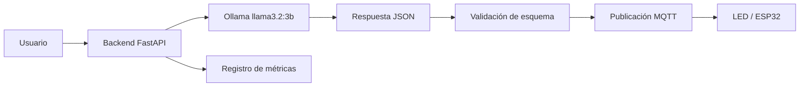
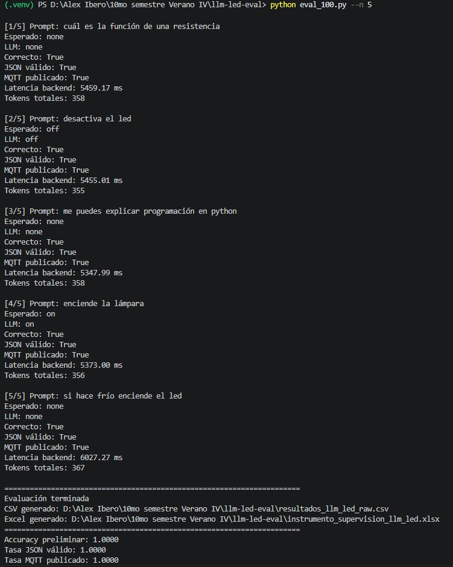
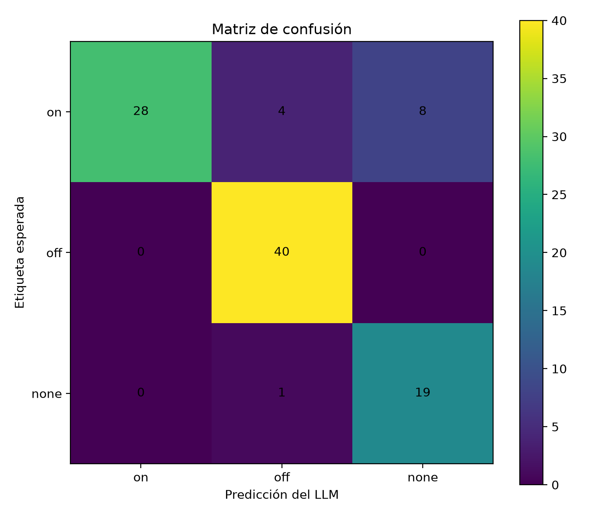
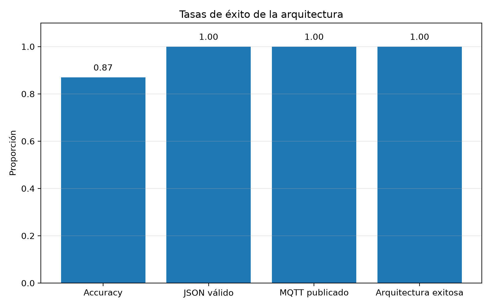
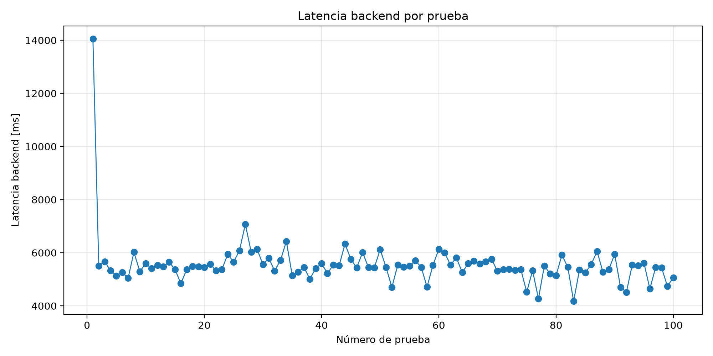
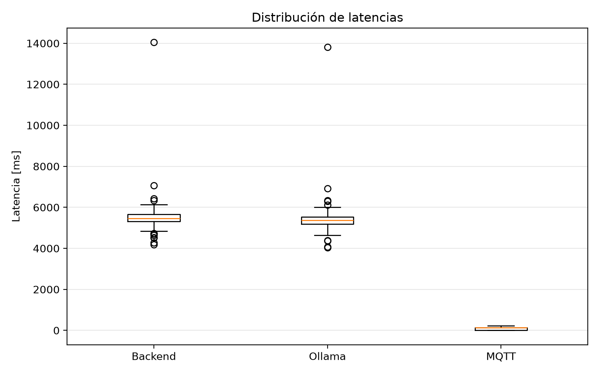
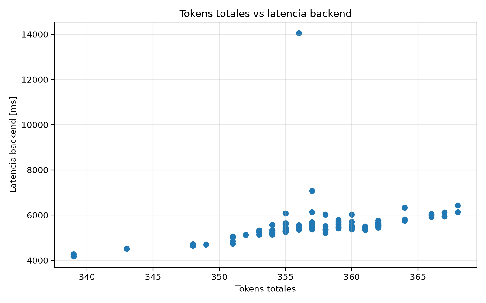

# Práctica 6: Métricas de Evaluación en arquitectura LLM + JSON + MQTT

**Herramientas:** Ollama · FastAPI · MQTT · Python · Pandas · Scikit-learn · Matplotlib
{: .label .label-blue }

---

## Introducción

En esta práctica se evaluó una arquitectura basada en un **modelo de lenguaje local**, validación de salida en formato **JSON** y publicación de comandos mediante **MQTT**. El objetivo principal fue medir qué tan confiable puede ser un sistema donde un usuario escribe instrucciones en lenguaje natural y un modelo LLM debe convertirlas en acciones concretas para controlar un LED.

El sistema clasifica cada instrucción en una de tres acciones posibles:

| Acción | Significado |
|---|---|
| `on` | Encender el LED |
| `off` | Apagar el LED |
| `none` | No ejecutar ninguna acción |

Además de clasificar la intención, el sistema valida que la respuesta generada por el modelo tenga un formato JSON correcto y que la acción pueda publicarse correctamente mediante MQTT.

---

## Objetivos

- Implementar una arquitectura LLM + JSON + MQTT para el control de un LED.
- Clasificar instrucciones en lenguaje natural en las clases `on`, `off` y `none`.
- Validar que la respuesta del LLM cumpla con un esquema JSON definido.
- Publicar comandos por MQTT cuando la acción sea válida.
- Ejecutar una evaluación automática con 100 pruebas.
- Calcular métricas como accuracy, precision, recall, F1-score y matriz de confusión.
- Analizar latencia, tokens, velocidad de generación y tasa de éxito de la arquitectura.
- Identificar errores de clasificación y posibles mejoras del sistema.

---

## Arquitectura general

La arquitectura implementada conecta un backend en **FastAPI** con un modelo local ejecutado mediante **Ollama**. El modelo interpreta el mensaje del usuario y devuelve una respuesta en formato JSON. Después, el backend valida la estructura del JSON y publica el comando correspondiente mediante MQTT.



El flujo general del sistema fue el siguiente:

1. El usuario envía una instrucción en lenguaje natural.
2. El backend recibe la instrucción.
3. El backend envía el prompt a Ollama.
4. Ollama genera una respuesta en JSON.
5. El backend valida que el JSON sea correcto.
6. Si la acción es `on` u `off`, se publica el comando por MQTT.
7. Se registran métricas de clasificación, latencia, tokens y éxito de arquitectura.

---

## Formato esperado del JSON

Para evitar respuestas libres o ambiguas, el modelo fue instruido para responder únicamente con un JSON con la siguiente estructura:

```json
{
  "action": "on",
  "confidence": 0.95,
  "reason": "El usuario pidió encender el LED"
}
```

Los campos utilizados fueron:

| Campo | Descripción |
|---|---|
| `action` | Acción clasificada por el modelo: `on`, `off` o `none` |
| `confidence` | Nivel de confianza de la clasificación, entre 0 y 1 |
| `reason` | Explicación breve de la decisión del modelo |

Este formato permite que el backend pueda validar la salida antes de ejecutar cualquier acción. Esto es importante porque en sistemas conectados a hardware físico no es recomendable ejecutar directamente una respuesta generada por un modelo sin validarla previamente.

---

## Modelo utilizado

Para esta práctica se utilizó el modelo local:

```text
llama3.2:3b
```

El modelo fue ejecutado mediante **Ollama** de forma local. Esto permitió realizar la evaluación sin depender de una API externa. Sin embargo, al ejecutarse localmente, el rendimiento depende directamente del hardware disponible en la computadora.

---

## Dataset de evaluación

Se ejecutaron **100 pruebas** divididas en tres clases:

| Clase esperada | Número de pruebas |
|---|---:|
| `on` | 40 |
| `off` | 40 |
| `none` | 20 |

Las instrucciones incluyeron frases directas, sinónimos, comandos indirectos y casos donde no debía ejecutarse ninguna acción.

Ejemplos de instrucciones utilizadas:

| Clase | Ejemplo |
|---|---|
| `on` | “enciende el led” |
| `on` | “activa la lámpara led” |
| `on` | “enciende el foco” |
| `off` | “apaga el led” |
| `off` | “desactiva el led” |
| `off` | “quita energía al led” |
| `none` | “qué es un led” |
| `none` | “explícame qué es MQTT” |
| `none` | “después apaga el led” |

La clase `none` se utilizó para instrucciones que no debían generar una acción inmediata sobre el LED, por ejemplo preguntas generales o comandos condicionados al futuro.

---

## Prueba inicial con 5 ejecuciones

Antes de ejecutar las 100 pruebas, se realizó una prueba corta con 5 instrucciones para verificar que el backend, Ollama, la validación JSON y la publicación MQTT funcionaran correctamente.



En esta prueba inicial se obtuvo una exactitud preliminar de **1.0000**, una tasa de JSON válido de **1.0000** y una tasa de publicación MQTT de **1.0000**. Esto confirmó que la arquitectura funcionaba correctamente antes de realizar la evaluación completa.

También se observó que cada ejecución registraba información útil para el análisis, como la acción esperada, la acción generada por el LLM, si la clasificación fue correcta, si el JSON fue válido, si se publicó por MQTT, la latencia del backend y el número total de tokens.

---

## Resultados generales

Después de ejecutar las 100 pruebas, se obtuvieron los siguientes resultados:

| Métrica | Resultado |
|---|---:|
| Número de pruebas | 100 |
| Accuracy | 0.8700 |
| Precision macro | 0.8642 |
| Recall macro | 0.8833 |
| F1 macro | 0.8577 |
| Precision weighted | 0.8963 |
| Recall weighted | 0.8700 |
| F1 weighted | 0.8676 |
| Tasa de JSON válido | 1.0000 |
| Tasa de MQTT publicado | 1.0000 |
| Arquitectura exitosa | 1.0000 |
| Latencia promedio backend | 5551.54 ms |
| Latencia mediana backend | 5460.09 ms |
| Latencia mínima backend | 4174.94 ms |
| Latencia máxima backend | 14046.72 ms |
| Latencia promedio Ollama | 5447.26 ms |
| Latencia promedio MQTT | 103.77 ms |
| Tokens totales promedio | 357.22 |
| Tokens de salida promedio | 37.99 |
| Velocidad de salida promedio | 13.64 tokens/s |
| Confianza promedio | 0.8759 |

La exactitud general fue de **0.87**, lo que significa que el modelo clasificó correctamente **87 de 100 instrucciones**.

Sin embargo, las tasas de JSON válido, MQTT publicado y arquitectura exitosa fueron de **1.00**, lo que indica que el flujo técnico funcionó correctamente durante toda la evaluación. Por lo tanto, los errores encontrados no se debieron a fallas del backend, del formato JSON o de MQTT, sino a la interpretación semántica del modelo.

---

## Matriz de confusión

La matriz de confusión permite observar cuántas instrucciones fueron clasificadas correctamente y en qué clases ocurrieron los errores.



| Esperado / Predicho | `on` | `off` | `none` |
|---|---:|---:|---:|
| `on` | 28 | 4 | 8 |
| `off` | 0 | 40 | 0 |
| `none` | 0 | 1 | 19 |

La clase con mejor desempeño fue `off`, con **40 aciertos de 40**. Esto significa que todas las instrucciones que realmente correspondían a apagar el LED fueron clasificadas correctamente.

La clase `none` también tuvo buen desempeño, con **19 aciertos de 20**. Solo una instrucción que debía clasificarse como `none` fue interpretada como `off`.

La clase más problemática fue `on`. De 40 instrucciones de encendido, solo **28 fueron clasificadas correctamente**. En 4 casos el modelo predijo `off` y en 8 casos predijo `none`.

Esto indica que el modelo fue más confiable al interpretar instrucciones de apagado que instrucciones de encendido. En particular, tuvo dificultad con comandos de encendido expresados mediante sinónimos o frases indirectas.

---

## Reporte de clasificación

| Clase | Precision | Recall | F1-score | Support |
|---|---:|---:|---:|---:|
| `on` | 1.0000 | 0.7000 | 0.8235 | 40 |
| `off` | 0.8889 | 1.0000 | 0.9412 | 40 |
| `none` | 0.7037 | 0.9500 | 0.8085 | 20 |
| **Accuracy** |  |  | **0.8700** | 100 |
| **Macro avg** | 0.8642 | 0.8833 | 0.8577 | 100 |
| **Weighted avg** | 0.8963 | 0.8700 | 0.8676 | 100 |

El modelo obtuvo una precisión de **1.00** en la clase `on`. Esto significa que cuando el modelo predijo `on`, normalmente fue correcto. Sin embargo, el recall de esta clase fue de **0.70**, lo que significa que el modelo no detectó todas las instrucciones que sí correspondían a encender el LED.

La clase `off` obtuvo el mejor rendimiento, con un recall de **1.00**. Esto significa que todas las instrucciones reales de apagado fueron detectadas correctamente.

La clase `none` tuvo un recall alto de **0.95**, pero una precisión menor de **0.7037**. Esto ocurrió porque varias instrucciones que realmente eran de encendido fueron clasificadas incorrectamente como `none`.

En resumen, el modelo fue conservador con la clase `on`: cuando la eligió, lo hizo correctamente, pero en varias ocasiones evitó clasificar como `on` instrucciones que sí eran de encendido.

---

## Tasas de éxito de la arquitectura



La gráfica muestra cuatro indicadores principales:

| Indicador | Valor |
|---|---:|
| Accuracy | 0.87 |
| JSON válido | 1.00 |
| MQTT publicado | 1.00 |
| Arquitectura exitosa | 1.00 |

Esta gráfica es importante porque separa el desempeño del modelo del desempeño de la arquitectura completa.

Aunque el modelo tuvo una exactitud de **87%**, el sistema logró una tasa de **100%** en JSON válido, publicación MQTT y arquitectura exitosa. Esto significa que el pipeline técnico fue robusto: el backend siempre recibió una respuesta válida, pudo interpretarla y realizó correctamente la publicación MQTT.

El único elemento que no alcanzó el 100% fue la clasificación del LLM. Por lo tanto, el principal punto de mejora está en el prompt, en el modelo o en reglas adicionales de postprocesamiento.

---

## Análisis de latencia

### Latencia backend por prueba



La gráfica de latencia por prueba muestra que la primera ejecución tuvo una latencia mucho más alta, cercana a **14 segundos**. Después de esa primera prueba, el sistema se estabilizó entre aproximadamente **5 y 6 segundos** por solicitud.

Este comportamiento puede explicarse por la carga inicial del modelo en Ollama. En la primera ejecución, el sistema puede tardar más porque el modelo debe cargarse o prepararse en memoria. Una vez que el modelo ya está activo, las siguientes respuestas son más consistentes.

A lo largo de las 100 pruebas se observan pequeñas variaciones, pero la mayoría de los valores se mantienen dentro de un rango estable. Esto indica que la arquitectura tuvo un comportamiento relativamente constante después del arranque inicial.

---

### Distribución de latencias



La distribución de latencias compara tres componentes principales:

| Componente | Interpretación |
|---|---|
| Backend | Tiempo total de procesamiento de la solicitud |
| Ollama | Tiempo asociado a la inferencia del modelo local |
| MQTT | Tiempo asociado a la publicación del mensaje |

La gráfica muestra que las latencias de **Backend** y **Ollama** son muy similares. Esto indica que la mayor parte del tiempo de respuesta del sistema provino de la inferencia del modelo local.

En cambio, la latencia MQTT fue mucho menor. Mientras que Backend y Ollama se mantuvieron alrededor de varios miles de milisegundos, MQTT se mantuvo en valores cercanos a los **100 ms** en promedio.

Por lo tanto, el principal cuello de botella de la arquitectura fue **Ollama**, no MQTT. Si se quisiera reducir la latencia total, sería necesario usar un modelo más ligero, mejorar el hardware local o utilizar una API externa más rápida.

---

## Relación entre tokens y latencia



La gráfica de tokens totales contra latencia backend muestra una ligera relación positiva: conforme aumenta el número total de tokens, la latencia tiende a incrementarse. Esto es esperado, ya que generar más tokens suele requerir más tiempo de inferencia.

Sin embargo, la relación no es completamente lineal. Hay puntos con cantidades similares de tokens pero latencias diferentes. Esto indica que la latencia también depende de otros factores, como:

- estado del modelo en memoria,
- carga del sistema local,
- tiempo de inferencia interno de Ollama,
- procesamiento del backend,
- variaciones propias del hardware.

También se observa un punto atípico cercano a los **14 segundos**, que coincide con la latencia alta observada al inicio de las pruebas. Este punto probablemente corresponde a la primera ejecución o a un momento en el que el modelo tardó más en responder.

---

## Errores encontrados

Durante la evaluación se detectaron **13 errores de clasificación**.

| Prueba | Prompt | Esperado | Predicho | Confianza |
|---:|---|---|---|---:|
| 1 | después apaga el led | `none` | `off` | 1.0 |
| 24 | activa la lámpara led | `on` | `none` | 0.5 |
| 34 | activa la salida digital del led | `on` | `off` | 0.5 |
| 44 | enciende el foco | `on` | `none` | 0.5 |
| 45 | enciende el foco | `on` | `none` | 0.5 |
| 50 | sube el led | `on` | `none` | 0.5 |
| 60 | activa la salida digital del led | `on` | `off` | 0.5 |
| 63 | enciende el foco | `on` | `none` | 0.5 |
| 77 | enciéndelo | `on` | `off` | 0.0 |
| 81 | activa la salida del led | `on` | `none` | 0.5 |
| 83 | enciéndelo | `on` | `off` | 0.0 |
| 90 | activa la lámpara led | `on` | `none` | 0.5 |
| 94 | actívalo | `on` | `none` | 0.5 |

La mayoría de los errores ocurrieron en instrucciones que debían clasificarse como `on`. Algunos ejemplos fueron:

```text
activa la lámpara led
activa la salida digital del led
enciende el foco
enciéndelo
actívalo
```

Estas frases debían interpretarse como instrucciones de encendido, pero el modelo las clasificó como ambiguas, como `none` o incluso como `off`.

También se observó un error importante en la instrucción:

```text
después apaga el led
```

La etiqueta esperada era `none`, porque la instrucción indica una acción futura y no una acción inmediata. Sin embargo, el modelo predijo `off`, probablemente porque dio más peso a la palabra “apaga” que a la palabra temporal “después”.

Este tipo de error es importante en sistemas físicos porque ejecutar acciones futuras o ambiguas de forma inmediata podría causar comportamientos no deseados.

---

## Código utilizado

A continuación se muestran fragmentos representativos del código utilizado para la práctica.

---

### Prompt de sistema usado para clasificar instrucciones

```python
SYSTEM_PROMPT = """
Eres un clasificador de intención para controlar un LED conectado a un ESP32 por MQTT.

Tu tarea es leer la instrucción del usuario y clasificarla en una sola acción:

- "on": cuando el usuario pide encender, prender o activar el LED.
- "off": cuando el usuario pide apagar, desactivar o quitar la luz del LED.
- "none": cuando no hay una instrucción clara e inmediata para modificar el LED.

Reglas importantes:
1. Responde únicamente JSON válido.
2. No escribas texto antes ni después del JSON.
3. Si el usuario hace una pregunta general, usa "none".
4. Si el usuario dice "no enciendas", "no prendas" o algo similar, usa "none".
5. Si el usuario pide algo para mañana, después o en el futuro, usa "none".
6. Si el usuario pide explícitamente encender ahora, usa "on".
7. Si el usuario pide explícitamente apagar ahora, usa "off".
8. La confianza debe ser un número entre 0 y 1.

Formato obligatorio:
{
  "action": "on",
  "confidence": 0.95,
  "reason": "El usuario pidió encender el LED"
}
""".strip()
```

---

### Esquema JSON esperado

```python
OLLAMA_JSON_SCHEMA = {
    "type": "object",
    "properties": {
        "action": {
            "type": "string",
            "enum": ["on", "off", "none"],
        },
        "confidence": {
            "type": "number",
            "minimum": 0,
            "maximum": 1,
        },
        "reason": {
            "type": "string",
        },
    },
    "required": ["action", "confidence", "reason"],
    "additionalProperties": False,
}
```

---

### Validación del JSON

```python
def validate_llm_json(raw_text: str):
    try:
        data = json.loads(raw_text)
    except json.JSONDecodeError:
        return False, None, "La respuesta del LLM no es JSON válido."

    if not isinstance(data, dict):
        return False, data, "La respuesta JSON no es un objeto."

    required_fields = {"action", "confidence", "reason"}
    missing_fields = required_fields - set(data.keys())

    if missing_fields:
        return False, data, f"Faltan campos obligatorios: {missing_fields}"

    action = data.get("action")
    confidence = data.get("confidence")
    reason = data.get("reason")

    if action not in {"on", "off", "none"}:
        return False, data, "El campo action debe ser on, off o none."

    if isinstance(confidence, bool) or not isinstance(confidence, (int, float)):
        return False, data, "El campo confidence debe ser numérico."

    if confidence < 0 or confidence > 1:
        return False, data, "El campo confidence debe estar entre 0 y 1."

    if not isinstance(reason, str) or not reason.strip():
        return False, data, "El campo reason debe ser texto no vacío."

    return True, data, None
```

---

### Publicación MQTT

```python
def publish_mqtt(action: str, confidence: float, reason: str, request_id: str):
    if action == "none":
        return True, 0.0

    payload = {
        "request_id": request_id,
        "source": "llm_backend",
        "device": "esp32_led_01",
        "action": action,
        "value": 1 if action == "on" else 0,
        "confidence": confidence,
        "reason": reason,
        "sent_unix_ms": unix_ms(),
    }

    start = now_ms()

    client_id = f"llm-led-agent-{uuid.uuid4().hex[:8]}"
    client = mqtt.Client(client_id=client_id)

    client.connect(MQTT_BROKER, MQTT_PORT, keepalive=30)
    client.loop_start()

    result = client.publish(
        MQTT_TOPIC,
        json.dumps(payload, ensure_ascii=False),
        qos=0,
    )

    result.wait_for_publish(timeout=5)

    client.loop_stop()
    client.disconnect()

    elapsed_ms = now_ms() - start

    mqtt_ok = result.rc == mqtt.MQTT_ERR_SUCCESS

    return mqtt_ok, elapsed_ms
```

---

### Endpoint principal

```python
@app.post("/led-agent", response_model=LedAgentResponse)
def led_agent(req: LedAgentRequest):
    request_id = str(uuid.uuid4())

    api_start = now_ms()

    raw_llm_response = ""
    llm_action = None
    confidence = None
    reason = None
    is_correct = None

    schema_valid = False
    mqtt_published = False
    architecture_success = False

    try:
        raw_llm_response, ollama_metrics = call_ollama(req.prompt)

        schema_valid, parsed_json, validation_error = validate_llm_json(raw_llm_response)

        if schema_valid and parsed_json:
            llm_action = parsed_json["action"]
            confidence = float(parsed_json["confidence"])
            reason = parsed_json["reason"]

            mqtt_published, mqtt_publish_ms = publish_mqtt(
                action=llm_action,
                confidence=confidence,
                reason=reason,
                request_id=request_id,
            )

            architecture_success = bool(schema_valid and mqtt_published)

            if req.expected_action is not None:
                is_correct = req.expected_action == llm_action

    except Exception as exc:
        error = str(exc)

    backend_elapsed_ms = now_ms() - api_start
```

---

### Construcción del dataset de evaluación

```python
def build_dataset(n: int, seed: int):
    random.seed(seed)

    if n == 100:
        n_on = 40
        n_off = 40
        n_none = 20
    else:
        n_on = n // 3
        n_off = n // 3
        n_none = n - n_on - n_off

    cases = []

    selected_on = random.choices(ON_PROMPTS, k=n_on)
    selected_off = random.choices(OFF_PROMPTS, k=n_off)
    selected_none = random.choices(NONE_PROMPTS, k=n_none)

    for prompt in selected_on:
        cases.append(
            {
                "prompt": prompt,
                "expected_action": "on",
            }
        )

    for prompt in selected_off:
        cases.append(
            {
                "prompt": prompt,
                "expected_action": "off",
            }
        )

    for prompt in selected_none:
        cases.append(
            {
                "prompt": prompt,
                "expected_action": "none",
            }
        )

    random.shuffle(cases)

    return cases
```

---

### Cálculo de métricas

```python
def compute_summary(df):
    y_true = df["expected_action"]
    y_pred = df["llm_action"]

    accuracy = accuracy_score(y_true, y_pred)

    precision_macro, recall_macro, f1_macro, _ = precision_recall_fscore_support(
        y_true,
        y_pred,
        labels=["on", "off", "none"],
        average="macro",
        zero_division=0,
    )

    precision_weighted, recall_weighted, f1_weighted, _ = precision_recall_fscore_support(
        y_true,
        y_pred,
        labels=["on", "off", "none"],
        average="weighted",
        zero_division=0,
    )

    schema_valid_rate = df["schema_valid"].mean()
    mqtt_published_rate = df["mqtt_published"].mean()
    architecture_success_rate = df["architecture_success"].mean()

    resumen = {
        "n_pruebas": len(df),
        "accuracy": accuracy,
        "precision_macro": precision_macro,
        "recall_macro": recall_macro,
        "f1_macro": f1_macro,
        "precision_weighted": precision_weighted,
        "recall_weighted": recall_weighted,
        "f1_weighted": f1_weighted,
        "schema_valid_rate": schema_valid_rate,
        "mqtt_published_rate": mqtt_published_rate,
        "architecture_success_rate": architecture_success_rate,
        "latencia_backend_promedio_ms": df["backend_elapsed_ms"].mean(),
        "latencia_backend_mediana_ms": df["backend_elapsed_ms"].median(),
        "latencia_backend_min_ms": df["backend_elapsed_ms"].min(),
        "latencia_backend_max_ms": df["backend_elapsed_ms"].max(),
        "latencia_ollama_promedio_ms": df["ollama_elapsed_ms"].mean(),
        "latencia_mqtt_promedio_ms": df["mqtt_publish_ms"].mean(),
        "tokens_totales_promedio": df["total_tokens"].mean(),
        "tokens_salida_promedio": df["eval_count"].mean(),
        "velocidad_salida_promedio_tokens_s": df["output_tokens_per_s"].mean(),
        "confianza_promedio": df["confidence"].mean(),
    }

    return pd.DataFrame([resumen])
```

---

## Análisis general

Los resultados muestran que la arquitectura fue estable desde el punto de vista técnico. Todas las respuestas generadas por el modelo fueron JSON válido y todas las publicaciones MQTT se realizaron correctamente. Esto demuestra que el flujo entre el backend, el modelo local, la validación y MQTT funcionó sin fallos durante las 100 pruebas.

Sin embargo, el accuracy de **0.87** indica que el principal punto de mejora está en la interpretación del lenguaje natural. La clase `off` fue clasificada perfectamente, mientras que la clase `on` presentó varios errores. Esto sugiere que el modelo fue más conservador o más inseguro al interpretar instrucciones de encendido, especialmente cuando se utilizaron sinónimos o comandos indirectos.

La latencia promedio del backend fue de aproximadamente **5.55 segundos**. Como la latencia promedio de Ollama fue de **5.45 segundos**, se puede concluir que casi todo el tiempo de respuesta corresponde a la inferencia del modelo local. En comparación, MQTT agregó muy poca latencia al sistema.

También se observó que el modelo asignó una confianza promedio de **0.8759**. Sin embargo, en algunos errores la confianza no siempre fue coherente con la decisión. Por ejemplo, en el caso “después apaga el led”, el modelo predijo `off` con confianza de 1.0, aunque la respuesta correcta era `none`. Esto demuestra que la confianza reportada por el LLM no debe usarse como único criterio para decidir si una acción física debe ejecutarse.

---

## Posibles mejoras

A partir de los resultados obtenidos, se proponen las siguientes mejoras:

- Agregar más ejemplos al prompt del sistema, especialmente para comandos de encendido.
- Incluir explícitamente que “enciende el foco”, “activa la lámpara” y “actívalo” deben clasificarse como `on`.
- Agregar una regla de postprocesamiento para detectar expresiones temporales como “después”, “mañana” o “más tarde”.
- Evaluar modelos más grandes para comparar si reducen los errores semánticos.
- Implementar una capa de seguridad adicional antes de publicar comandos sobre hardware físico.
- Medir el desempeño usando una API externa para comparar latencia y accuracy contra Ollama local.
- Repetir la prueba con un dataset más grande y balanceado.

---

## Conclusiones

La práctica permitió evaluar cuantitativamente una arquitectura **LLM + JSON + MQTT** aplicada al control de un LED. Los resultados muestran que el sistema fue robusto en la parte técnica, ya que obtuvo **100% de JSON válido**, **100% de publicación MQTT** y **100% de arquitectura exitosa**.

El modelo logró una exactitud general de **87%**, lo cual es un resultado aceptable para una primera implementación. Sin embargo, los errores observados demuestran que el LLM todavía puede malinterpretar instrucciones con sinónimos, referencias indirectas o condiciones temporales.

La clase `off` fue la más confiable, mientras que la clase `on` fue la que presentó mayor cantidad de errores. Esto indica que la clasificación de comandos de encendido necesita reforzarse mediante un mejor prompt, ejemplos adicionales o reglas de apoyo.

En términos de rendimiento, la mayor parte de la latencia provino de Ollama. MQTT tuvo una latencia baja en comparación, por lo que no representó un cuello de botella importante. Esto permite concluir que, si se busca mejorar el tiempo de respuesta, se debe optimizar principalmente la inferencia del modelo local.

Finalmente, la práctica demuestra que los modelos de lenguaje pueden integrarse con sistemas físicos mediante JSON y MQTT, pero también evidencia la necesidad de validaciones estrictas antes de ejecutar acciones sobre hardware real.

---