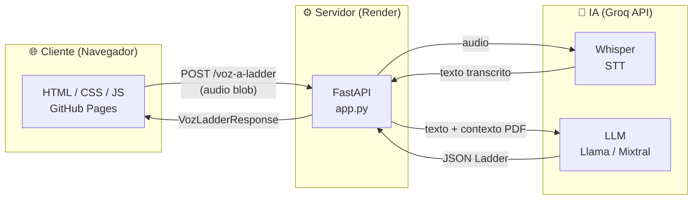
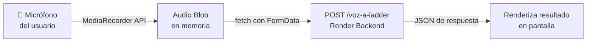
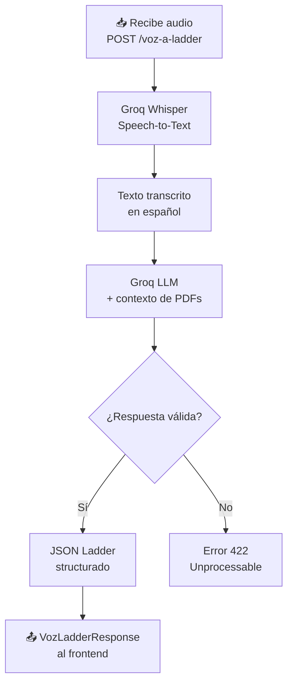
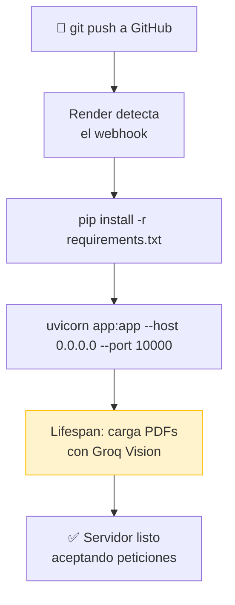
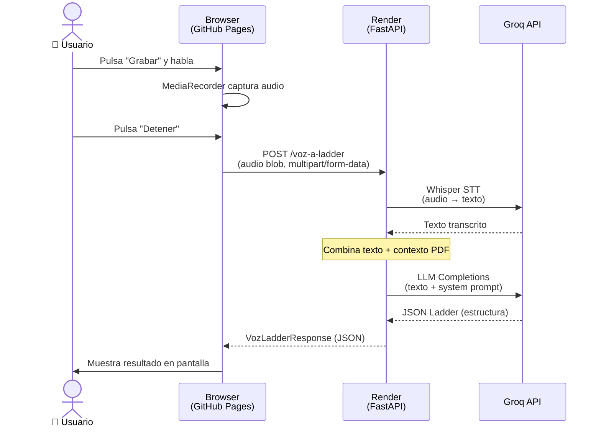
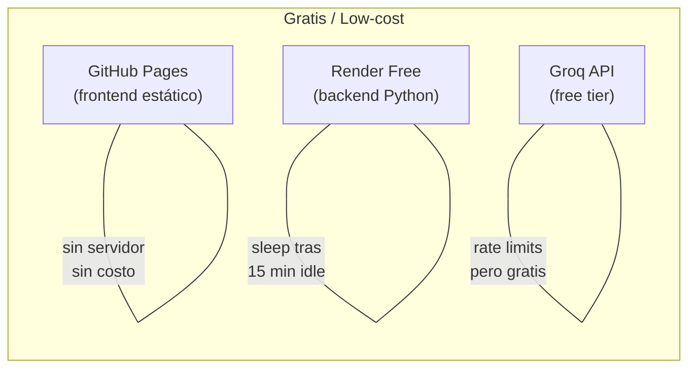

# Cómo funciona todo el sistema conectado

**Arquitectura:** GitHub Pages · FastAPI · Groq API · Render
{: .label .label-blue }

---

## Visión general

El sistema integra tres capas independientes que se comunican entre sí: un **frontend estático** servido desde GitHub Pages, un **backend Python** ejecutado en Render, y la **API de Groq** como motor de procesamiento de voz e inteligencia artificial.



> **Regla de oro:** El frontend nunca procesa — solo captura y muestra. Todo el procesamiento vive en el backend.

---

## 1. El Frontend (GitHub Pages)

El frontend es una aplicación **completamente estática**: no hay servidor Python ni Node.js ejecutándose. GitHub Pages sirve archivos HTML, CSS y JavaScript directamente desde el repositorio.

### ¿Qué hace el frontend?

```
Usuario habla → micrófono → audio blob → fetch POST /voz-a-ladder
```



### Fragmento representativo del cliente

```javascript
// Captura de audio en el navegador
const stream = await navigator.mediaDevices.getUserMedia({ audio: true });
const recorder = new MediaRecorder(stream);
let chunks = [];

recorder.ondataavailable = e => chunks.push(e.data);
recorder.onstop = async () => {
    const blob = new Blob(chunks, { type: 'audio/webm' });

    // Envío al backend
    const form = new FormData();
    form.append('audio', blob, 'grabacion.webm');

    const res = await fetch('https://tu-app.onrender.com/voz-a-ladder', {
        method: 'POST',
        body: form
    });
    const data = await res.json();  // VozLadderResponse
    mostrarResultado(data);
};
recorder.start();
```

| Responsabilidad | ¿Quién la hace? |
|----------------|-----------------|
| Capturar audio del micrófono | Browser (`MediaRecorder API`) |
| Convertir audio a blob | Browser (JavaScript) |
| Enviar al backend | `fetch()` en el cliente |
| Mostrar el resultado | Manipulación del DOM |
| Procesar el audio / llamar a IA | ❌ **No — lo hace el backend** |

---

## 2. El Backend (Render)

El backend es un servidor Python real ejecutado en Render. Al recibir una petición de audio, orquesta dos llamadas secuenciales a la API de Groq.

### Flujo interno

```
Recibe audio → Groq Whisper (STT) → texto → Groq LLM → JSON Ladder → respuesta
```



### Estructura simplificada de `app.py`

```python
from fastapi import FastAPI, UploadFile
from groq import Groq

app = FastAPI()
client = Groq()

# Al arrancar el servidor, se cargan los PDFs con Vision
contexto_pdf = cargar_pdfs_con_vision()

@app.post("/voz-a-ladder")
async def voz_a_ladder(audio: UploadFile):
    # Paso 1 — Transcribir audio con Whisper
    transcripcion = client.audio.transcriptions.create(
        model="whisper-large-v3",
        file=(audio.filename, await audio.read()),
        language="es"
    )

    # Paso 2 — LLM genera estructura Ladder
    respuesta = client.chat.completions.create(
        model="llama-3.3-70b-versatile",
        messages=[
            {"role": "system", "content": contexto_pdf},
            {"role": "user",   "content": transcripcion.text}
        ],
        response_format={"type": "json_object"}
    )

    return VozLadderResponse.model_validate_json(
        respuesta.choices[0].message.content
    )
```

> **Nota sobre el contexto:** `contexto_pdf` se carga **una sola vez** cuando el servidor arranca. Cada reinicio recarga todos los PDFs, lo que consume tokens de Groq Vision.

---

## 3. Render como hosting

Render actúa como un servidor gestionado: toma el repositorio de GitHub, instala dependencias y mantiene el proceso activo.

### Ciclo de vida de un despliegue

```
GitHub push → Render detecta cambio → rebuild → reinicia servidor → carga PDFs de nuevo
```



### Configuración clave en Render

| Parámetro | Valor típico | Descripción |
|-----------|-------------|-------------|
| **Build Command** | `pip install -r requirements.txt` | Instala dependencias en cada deploy |
| **Start Command** | `uvicorn app:app --host 0.0.0.0 --port $PORT` | Inicia el servidor ASGI |
| **Environment Variables** | `GROQ_API_KEY`, etc. | Se configuran en el dashboard de Render |
| **Plan** | Free / Starter | El plan gratuito "hiberna" tras 15 min de inactividad |

> **Problema conocido:** Cada reinicio recarga los PDFs desde cero, gastando tokens de Groq Vision. Una solución es cachear el contexto serializado en disco o en una variable de entorno.

---

## 4. El flujo completo de una petición de voz

Este diagrama muestra toda la cadena de eventos desde que el usuario habla hasta que ve el resultado.



### Resumen de responsabilidades por capa

| Capa | Tecnología | Responsabilidad principal |
|------|-----------|--------------------------|
| **Frontend** | HTML/JS (GitHub Pages) | Capturar audio · Enviar al backend · Mostrar resultado |
| **Backend** | FastAPI (Render) | Orquestar llamadas a Groq · Validar respuesta |
| **STT** | Groq Whisper | Convertir audio a texto |
| **LLM** | Groq (Llama / Mixtral) | Generar estructura Ladder desde el texto |
| **Contexto** | PDFs + Groq Vision | Proveer información del dominio al LLM |

---

## ¿Por qué esta arquitectura?



| Decisión | Alternativa descartada | Razón |
|----------|----------------------|-------|
| GitHub Pages para frontend | Netlify, Vercel | Integración nativa con el repo |
| Render para backend | Railway, Fly.io | Plan gratuito, deploy desde GitHub |
| Groq para STT + LLM | OpenAI, Ollama | Velocidad (LPU) y capa gratuita generosa |
| FastAPI | Flask, Django | Validación de tipos con Pydantic, soporte async nativo |
