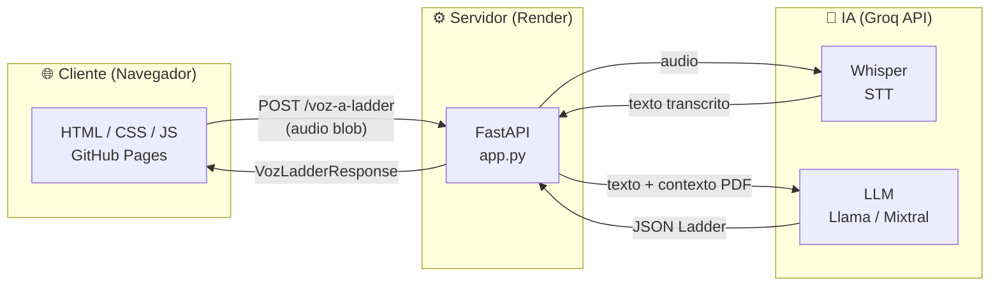
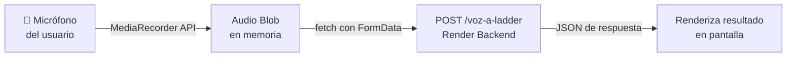
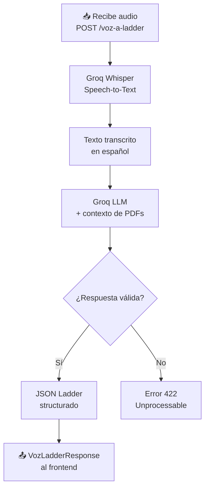
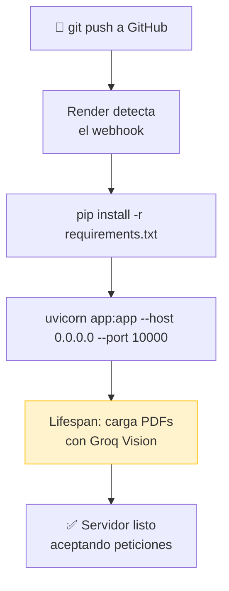
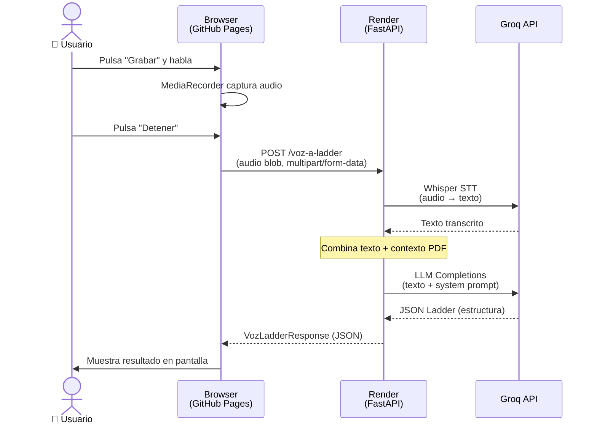

# Cómo funciona todo el sistema conectado

**Arquitectura:** GitHub Pages · FastAPI · Groq API · Render
{: .label .label-blue }

---

## Visión general

El sistema integra tres capas independientes que se comunican entre sí: un **frontend estático** servido desde GitHub Pages, un **backend Python** ejecutado en Render, y la **API de Groq** como motor de procesamiento de voz e inteligencia artificial.



> **Regla de oro:** El frontend nunca procesa — solo captura y muestra. Todo el procesamiento vive en el backend.

---

## 1. El Frontend (GitHub Pages)

El frontend es una aplicación **completamente estática**: no hay servidor Python ni Node.js ejecutándose. GitHub Pages sirve archivos HTML, CSS y JavaScript directamente desde el repositorio.

### ¿Qué hace el frontend?

```
Usuario habla → micrófono → audio blob → fetch POST /voz-a-ladder
```



### Fragmento representativo del cliente

```javascript
// Captura de audio en el navegador
const stream = await navigator.mediaDevices.getUserMedia({ audio: true });
const recorder = new MediaRecorder(stream);
let chunks = [];

recorder.ondataavailable = e => chunks.push(e.data);
recorder.onstop = async () => {
    const blob = new Blob(chunks, { type: 'audio/webm' });

    // Envío al backend
    const form = new FormData();
    form.append('audio', blob, 'grabacion.webm');

    const res = await fetch('https://tu-app.onrender.com/voz-a-ladder', {
        method: 'POST',
        body: form
    });
    const data = await res.json();  // VozLadderResponse
    mostrarResultado(data);
};
recorder.start();
```

| Responsabilidad | ¿Quién la hace? |
|----------------|-----------------|
| Capturar audio del micrófono | Browser (`MediaRecorder API`) |
| Convertir audio a blob | Browser (JavaScript) |
| Enviar al backend | `fetch()` en el cliente |
| Mostrar el resultado | Manipulación del DOM |
| Procesar el audio / llamar a IA | ❌ **No — lo hace el backend** |

---

## 2. El Backend (Render)

El backend es un servidor Python real ejecutado en Render. Al recibir una petición de audio, orquesta dos llamadas secuenciales a la API de Groq.

### Flujo interno

```
Recibe audio → Groq Whisper (STT) → texto → Groq LLM → JSON Ladder → respuesta
```



### Estructura simplificada de `app.py`

```python
from fastapi import FastAPI, UploadFile
from groq import Groq

app = FastAPI()
client = Groq()

# Al arrancar el servidor, se cargan los PDFs con Vision
contexto_pdf = cargar_pdfs_con_vision()

@app.post("/voz-a-ladder")
async def voz_a_ladder(audio: UploadFile):
    # Paso 1 — Transcribir audio con Whisper
    transcripcion = client.audio.transcriptions.create(
        model="whisper-large-v3",
        file=(audio.filename, await audio.read()),
        language="es"
    )

    # Paso 2 — LLM genera estructura Ladder
    respuesta = client.chat.completions.create(
        model="llama-3.3-70b-versatile",
        messages=[
            {"role": "system", "content": contexto_pdf},
            {"role": "user",   "content": transcripcion.text}
        ],
        response_format={"type": "json_object"}
    )

    return VozLadderResponse.model_validate_json(
        respuesta.choices[0].message.content
    )
```

> **Nota sobre el contexto:** `contexto_pdf` se carga **una sola vez** cuando el servidor arranca. Cada reinicio recarga todos los PDFs, lo que consume tokens de Groq Vision.

---

## 3. Render como hosting

Render actúa como un servidor gestionado: toma el repositorio de GitHub, instala dependencias y mantiene el proceso activo.

### Ciclo de vida de un despliegue

```
GitHub push → Render detecta cambio → rebuild → reinicia servidor → carga PDFs de nuevo
```



### Configuración clave en Render

| Parámetro | Valor típico | Descripción |
|-----------|-------------|-------------|
| **Build Command** | `pip install -r requirements.txt` | Instala dependencias en cada deploy |
| **Start Command** | `uvicorn app:app --host 0.0.0.0 --port $PORT` | Inicia el servidor ASGI |
| **Environment Variables** | `GROQ_API_KEY`, etc. | Se configuran en el dashboard de Render |
| **Plan** | Free / Starter | El plan gratuito "hiberna" tras 15 min de inactividad |

> **Problema conocido:** Cada reinicio recarga los PDFs desde cero, gastando tokens de Groq Vision. Una solución es cachear el contexto serializado en disco o en una variable de entorno.

---

## 4. El flujo completo de una petición de voz

Este diagrama muestra toda la cadena de eventos desde que el usuario habla hasta que ve el resultado.



### Resumen de responsabilidades por capa

| Capa | Tecnología | Responsabilidad principal |
|------|-----------|--------------------------|
| **Frontend** | HTML/JS (GitHub Pages) | Capturar audio · Enviar al backend · Mostrar resultado |
| **Backend** | FastAPI (Render) | Orquestar llamadas a Groq · Validar respuesta |
| **STT** | Groq Whisper | Convertir audio a texto |
| **LLM** | Groq (Llama / Mixtral) | Generar estructura Ladder desde el texto |
| **Contexto** | PDFs + Groq Vision | Proveer información del dominio al LLM |

---

## ¿Por qué esta arquitectura?

La restricción principal fue el costo: todo tenía que funcionar gratis o casi gratis para poder desarrollarlo sin una tarjeta de crédito con presupuesto real. A partir de eso las decisiones se fueron tomando solas.

| Herramienta | Costo | Por qué la elegí | Lo que sacrificas |
|-------------|-------|-----------------|-------------------|
| **GitHub Pages** | Gratis | Ya tenía el repo ahí, sin configuración extra | Solo sirve archivos estáticos, no ejecuta Python |
| **Render (free tier)** | Gratis | Deploy directo desde GitHub, sin tocar infraestructura | Se "duerme" a los 15 min, el primer request tarda ~30 s |
| **Groq API** | Gratis (con límites) | Sus LPUs son notablemente más rápidos que otras APIs gratuitas | Rate limits: si mandas muchas peticiones seguidas te bloquea |
| **FastAPI** | — | Validación automática con Pydantic y async sin mucho código extra | Curva de aprendizaje si vienes de Flask |

La separación en tres capas no fue un diseño planeado desde el inicio — fue lo que quedó natural al ir conectando las piezas. El frontend no puede llamar a Groq directamente porque expondrías tu API key en el código del navegador, así que el backend termina siendo el intermediario obligado.

---

## Comparación de modelos

Script para comparar velocidad y rendimiento entre **Groq Cloud** (`openai/gpt-oss-120b`) y un modelo local corriendo con **vLLM** (`QuixiAI/Qwen3-30B-A3B-AWQ`). Útil para decidir qué modelo usar según latencia y tokens por segundo en cada tipo de prompt.

**Instalación:**

```bash
pip install groq requests python-dotenv
```

**Uso:**

```bash
python benchmark_modelos.py              # corre todo
python benchmark_modelos.py --runs 5     # 5 repeticiones por prompt
python benchmark_modelos.py --solo groq  # solo Groq
python benchmark_modelos.py --solo local # solo local
```

**Código completo:**

```python
# benchmark_modelos.py
# Compara velocidad y rendimiento entre:
#   - Groq Cloud : openai/gpt-oss-120b
#   - Local vLLM : QuixiAI/Qwen3-30B-A3B-AWQ

import os
import sys
import time
import json
import argparse
import statistics
import requests
from groq import Groq
from dotenv import load_dotenv

load_dotenv()

# ─────────────────────────────────────────────────────────────────
# CONFIGURACION
# ─────────────────────────────────────────────────────────────────
GROQ_MODEL    = "openai/gpt-oss-120b"
LOCAL_MODEL   = "QuixiAI/Qwen3-30B-A3B-AWQ"
LOCAL_URL     = "http://172.16.2.34:8000/v1/chat/completions"
LOCAL_TIMEOUT = 120   # segundos — modelo local puede tardar más

groq_client = Groq(api_key=os.environ.get("GROQ_API_KEY"))

# ─────────────────────────────────────────────────────────────────
# PROMPTS DE PRUEBA — relevantes para tu caso PLC/Ladder
# ─────────────────────────────────────────────────────────────────
PROMPTS = [
    {
        "nombre": "Corto — saludo",
        "system": "You are a helpful assistant. /no_think",
        "user":   "Say hello in one sentence.",
        "max_tokens": 50,
    },
    {
        "nombre": "Medio — explicacion tecnica",
        "system": "You are a helpful assistant. /no_think",
        "user":   "Explain what is a PLC in 3 sentences.",
        "max_tokens": 200,
    },
    {
        "nombre": "Largo — generacion JSON Ladder",
        "system": (
            "Eres experto en PLCs Horner Ladder. "
            "Responde SOLO con JSON valido, sin texto adicional."
        ),
        "user": (
            "Crea un enclavamiento: arranque %I1, paro %I2, emergencia %I8, salida %M1, lampara %Q10. "
            "Responde con: {\"programa_nombre\":\"string\","
            "\"logica_ladder\":[{\"renglon\":1,\"descripcion\":\"string\","
            "\"filas\":[{\"fila\":0,\"elementos\":[{\"tipo\":\"XIC\",\"operando\":\"%I1\"}]}]}],"
            "\"explicacion_simple\":\"string\"}"
        ),
        "max_tokens": 1024,
    },
    {
        "nombre": "Muy largo — programa completo",
        "system": (
            "Eres experto en PLCs Horner Ladder. "
            "Responde SOLO con JSON valido."
        ),
        "user": (
            "Genera un programa completo con: enclavamiento con arranque %I1 paro %I2, "
            "temporizador TON 5000ms, contador CTU hasta 10, "
            "lampara verde %Q10 cuando activo, roja %Q12 cuando inactivo, "
            "amarilla %Q11 parpadeando con el timer. "
            "JSON: {\"programa_nombre\":\"string\",\"logica_ladder\":[...],\"explicacion_simple\":\"string\"}"
        ),
        "max_tokens": 2048,
    },
]

# ─────────────────────────────────────────────────────────────────
# LLAMADA A GROQ
# ─────────────────────────────────────────────────────────────────
def llamar_groq(prompt: dict) -> dict:
    t0 = time.time()
    try:
        resp = groq_client.chat.completions.create(
            messages=[
                {"role": "system", "content": prompt["system"]},
                {"role": "user",   "content": prompt["user"]},
            ],
            model=GROQ_MODEL,
            temperature=0.7,
            max_tokens=prompt["max_tokens"],
        )
        t_total = time.time() - t0
        ti  = resp.usage.prompt_tokens
        ts  = resp.usage.completion_tokens
        txt = resp.choices[0].message.content or ""
        return {
            "ok":          True,
            "t_total":     t_total,
            "tokens_in":   ti,
            "tokens_out":  ts,
            "tok_per_seg": ts / t_total if t_total > 0 else 0,
            "chars_out":   len(txt),
            "error":       None,
        }
    except Exception as e:
        return {
            "ok": False, "t_total": time.time() - t0,
            "tokens_in": 0, "tokens_out": 0,
            "tok_per_seg": 0, "chars_out": 0, "error": str(e),
        }

# ─────────────────────────────────────────────────────────────────
# LLAMADA AL MODELO LOCAL (vLLM / OpenAI-compatible)
# ─────────────────────────────────────────────────────────────────
def llamar_local(prompt: dict) -> dict:
    payload = {
        "model": LOCAL_MODEL,
        "messages": [
            {"role": "system", "content": prompt["system"]},
            {"role": "user",   "content": prompt["user"]},
        ],
        "max_tokens":  prompt["max_tokens"],
        "temperature": 0.7,
    }
    t0 = time.time()
    try:
        resp = requests.post(
            LOCAL_URL,
            headers={"Content-Type": "application/json"},
            json=payload,
            timeout=LOCAL_TIMEOUT,
        )
        t_total = time.time() - t0
        resp.raise_for_status()
        data = resp.json()

        ti  = data.get("usage", {}).get("prompt_tokens", 0)
        ts  = data.get("usage", {}).get("completion_tokens", 0)
        txt = data["choices"][0]["message"]["content"] or ""

        return {
            "ok":          True,
            "t_total":     t_total,
            "tokens_in":   ti,
            "tokens_out":  ts,
            "tok_per_seg": ts / t_total if t_total > 0 else 0,
            "chars_out":   len(txt),
            "error":       None,
        }
    except requests.exceptions.ConnectionError:
        return {
            "ok": False, "t_total": time.time() - t0,
            "tokens_in": 0, "tokens_out": 0,
            "tok_per_seg": 0, "chars_out": 0,
            "error": "No se pudo conectar a http://172.16.2.34:8000 — verifica que el servidor este corriendo",
        }
    except Exception as e:
        return {
            "ok": False, "t_total": time.time() - t0,
            "tokens_in": 0, "tokens_out": 0,
            "tok_per_seg": 0, "chars_out": 0, "error": str(e),
        }

# ─────────────────────────────────────────────────────────────────
# EJECUTAR BENCHMARK PARA UN MODELO
# ─────────────────────────────────────────────────────────────────
def run_benchmark(nombre_modelo: str, fn_llamar, n_runs: int) -> dict:
    print(f"\n{'='*65}")
    print(f"  MODELO: {nombre_modelo}")
    print(f"{'='*65}")

    resultados_por_prompt = {}

    for prompt in PROMPTS:
        nombre_p = prompt["nombre"]
        print(f"\n  ▶ Prompt: {nombre_p} (max_tokens={prompt['max_tokens']})")
        runs = []

        for i in range(n_runs):
            print(f"    Run {i+1}/{n_runs}...", end=" ", flush=True)
            r = fn_llamar(prompt)

            if r["ok"]:
                print(
                    f"{r['t_total']:.2f}s | "
                    f"in={r['tokens_in']} out={r['tokens_out']} | "
                    f"{r['tok_per_seg']:.1f} tok/s"
                )
            else:
                print(f"ERROR — {r['error']}")

            runs.append(r)
            time.sleep(0.8)  # pausa entre runs

        resultados_por_prompt[nombre_p] = runs

    return resultados_por_prompt

# ─────────────────────────────────────────────────────────────────
# CALCULAR ESTADISTICAS
# ─────────────────────────────────────────────────────────────────
def estadisticas(runs: list) -> dict:
    ok_runs = [r for r in runs if r["ok"]]
    if not ok_runs:
        return {"n_ok": 0, "n_err": len(runs)}
    lat  = [r["t_total"]     for r in ok_runs]
    tps  = [r["tok_per_seg"] for r in ok_runs]
    tout = [r["tokens_out"]  for r in ok_runs]
    return {
        "n_ok":       len(ok_runs),
        "n_err":      len(runs) - len(ok_runs),
        "lat_prom":   statistics.mean(lat),
        "lat_min":    min(lat),
        "lat_max":    max(lat),
        "lat_std":    statistics.stdev(lat) if len(lat) > 1 else 0,
        "tps_prom":   statistics.mean(tps),
        "tout_prom":  statistics.mean(tout),
    }

# ─────────────────────────────────────────────────────────────────
# TABLA COMPARATIVA
# ─────────────────────────────────────────────────────────────────
def imprimir_tabla(res_groq: dict, res_local: dict):
    print(f"\n\n{'#'*65}")
    print(f"  TABLA COMPARATIVA DE RESULTADOS")
    print(f"  Groq  : {GROQ_MODEL}")
    print(f"  Local : {LOCAL_MODEL}")
    print(f"{'#'*65}")

    col = 22
    header = (
        f"{'Prompt':<28} | "
        f"{'Groq lat':>{col}} | "
        f"{'Local lat':>{col}} | "
        f"{'Ganador':<10}"
    )
    print(f"\n{header}")
    print("─" * len(header))

    groq_gana  = 0
    local_gana = 0
    empates    = 0

    puntos_groq  = {"lat": [], "tps": []}
    puntos_local = {"lat": [], "tps": []}

    for nombre_p in res_groq:
        eg = estadisticas(res_groq[nombre_p])
        el = estadisticas(res_local.get(nombre_p, []))

        if eg["n_ok"] == 0 and el["n_ok"] == 0:
            ganador = "─ ambos fallaron"
        elif eg["n_ok"] == 0:
            ganador = "🏠 Local"
            local_gana += 1
        elif el["n_ok"] == 0:
            ganador = "☁  Groq"
            groq_gana += 1
        elif eg["lat_prom"] < el["lat_prom"] * 0.95:
            ganador = "☁  Groq"
            groq_gana += 1
        elif el["lat_prom"] < eg["lat_prom"] * 0.95:
            ganador = "🏠 Local"
            local_gana += 1
        else:
            ganador = "≈ Empate"
            empates += 1

        if eg["n_ok"] > 0:
            puntos_groq["lat"].append(eg["lat_prom"])
            puntos_groq["tps"].append(eg["tps_prom"])
        if el["n_ok"] > 0:
            puntos_local["lat"].append(el["lat_prom"])
            puntos_local["tps"].append(el["tps_prom"])

        lat_g = f"{eg['lat_prom']:.2f}s (±{eg['lat_std']:.2f})" if eg["n_ok"] > 0 else "ERROR"
        lat_l = f"{el['lat_prom']:.2f}s (±{el['lat_std']:.2f})" if el["n_ok"] > 0 else "ERROR"

        nombre_corto = nombre_p[:26]
        print(f"  {nombre_corto:<26} | {lat_g:>{col}} | {lat_l:>{col}} | {ganador}")

    print("─" * len(header))

    # Totales
    print(f"\n{'─'*65}")
    print(f"  RESUMEN GLOBAL")
    print(f"{'─'*65}")

    if puntos_groq["lat"]:
        pg_lat = statistics.mean(puntos_groq["lat"])
        pg_tps = statistics.mean(puntos_groq["tps"])
        print(f"  Groq  — lat promedio: {pg_lat:.2f}s | tok/s promedio: {pg_tps:.1f}")
    else:
        print(f"  Groq  — sin resultados validos")
        pg_lat = float("inf")
        pg_tps = 0

    if puntos_local["lat"]:
        pl_lat = statistics.mean(puntos_local["lat"])
        pl_tps = statistics.mean(puntos_local["tps"])
        print(f"  Local — lat promedio: {pl_lat:.2f}s | tok/s promedio: {pl_tps:.1f}")
    else:
        print(f"  Local — sin resultados validos")
        pl_lat = float("inf")
        pl_tps = 0

    print(f"\n  Victorias: ☁ Groq={groq_gana} | 🏠 Local={local_gana} | ≈ Empates={empates}")

    # ── RECOMENDACION FINAL ──────────────────────────────────────
    print(f"\n{'─'*65}")
    print(f"  RECOMENDACION FINAL")
    print(f"{'─'*65}")

    if pg_lat == float("inf") and pl_lat == float("inf"):
        print("  ⚠  Ambos modelos fallaron. Verifica conexiones y API keys.")

    elif pl_lat == float("inf"):
        print(f"  ✅  Usa GROQ — el modelo local no respondio.")
        print(f"      Verifica que vLLM este corriendo en 172.16.2.34:8000")

    elif pg_lat == float("inf"):
        print(f"  ✅  Usa LOCAL — Groq no respondio.")

    elif pl_lat < pg_lat * 0.85:
        diff = ((pg_lat - pl_lat) / pg_lat) * 100
        print(f"  🏠  Usa LOCAL — es {diff:.0f}% mas rapido que Groq.")
        print(f"      Latencia: {pl_lat:.2f}s vs {pg_lat:.2f}s")
        print(f"      Ventaja adicional: sin costo por token, sin rate limits.")

    elif pg_lat < pl_lat * 0.85:
        diff = ((pl_lat - pg_lat) / pl_lat) * 100
        print(f"  ☁   Usa GROQ — es {diff:.0f}% mas rapido que el modelo local.")
        print(f"      Latencia: {pg_lat:.2f}s vs {pl_lat:.2f}s")
        print(f"      Considera optimizar vLLM: batch size, quantization settings.")

    else:
        diff = abs(pl_lat - pg_lat) / max(pg_lat, pl_lat) * 100
        print(f"  ≈   RENDIMIENTO SIMILAR (diferencia < 15%, aprox {diff:.0f}%)")
        print(f"      Latencia Groq : {pg_lat:.2f}s")
        print(f"      Latencia Local: {pl_lat:.2f}s")
        print(f"      Recomendacion : usa LOCAL para evitar costos y rate limits.")
        print(f"      Si necesitas mas calidad de respuesta, prueba con Groq.")

    print(f"\n  Tokens/seg (mayor = mejor):")
    print(f"    Groq  : {pg_tps:.1f} tok/s")
    print(f"    Local : {pl_tps:.1f} tok/s")

    ganador_tps = "☁  Groq" if pg_tps > pl_tps else "🏠 Local"
    print(f"    Ganador velocidad generacion: {ganador_tps}")

    print(f"\n{'#'*65}\n")

# ─────────────────────────────────────────────────────────────────
# VERIFICAR CONECTIVIDAD
# ─────────────────────────────────────────────────────────────────
def verificar_conexiones(solo: str):
    print(f"\n{'─'*65}")
    print("  Verificando conexiones...")

    if solo != "local":
        try:
            groq_client.models.list()
            print(f"  ✓ Groq API     : OK")
        except Exception as e:
            print(f"  ✗ Groq API     : ERROR — {e}")

    if solo != "groq":
        try:
            r = requests.get(
                "http://172.16.2.34:8000/v1/models",
                timeout=5
            )
            modelos = r.json()
            print(f"  ✓ Local vLLM   : OK — modelos disponibles: {[m['id'] for m in modelos.get('data',[])]}")
        except requests.exceptions.ConnectionError:
            print(f"  ✗ Local vLLM   : No se puede conectar a 172.16.2.34:8000")
            print(f"    Asegurate que el servidor vLLM este corriendo.")
        except Exception as e:
            print(f"  ✗ Local vLLM   : {e}")

    print(f"{'─'*65}")

# ─────────────────────────────────────────────────────────────────
# MAIN
# ─────────────────────────────────────────────────────────────────
if __name__ == "__main__":
    parser = argparse.ArgumentParser(description="Benchmark Groq vs Local vLLM")
    parser.add_argument("--runs", type=int, default=3,
                        help="Numero de repeticiones por prompt (default: 3)")
    parser.add_argument("--solo", choices=["groq", "local"], default=None,
                        help="Correr solo un modelo")
    args = parser.parse_args()

    print(f"\n{'#'*65}")
    print(f"  BENCHMARK LLM — Groq vs Local vLLM")
    print(f"  Groq  : {GROQ_MODEL}")
    print(f"  Local : {LOCAL_MODEL}")
    print(f"  URL   : {LOCAL_URL}")
    print(f"  Runs  : {args.runs} por prompt")
    print(f"  Prompts: {len(PROMPTS)}")
    print(f"{'#'*65}")

    verificar_conexiones(args.solo or "ambos")

    res_groq  = {}
    res_local = {}

    if args.solo != "local":
        res_groq = run_benchmark(
            f"GROQ — {GROQ_MODEL}",
            llamar_groq,
            args.runs
        )

    if args.solo != "groq":
        res_local = run_benchmark(
            f"LOCAL — {LOCAL_MODEL}",
            llamar_local,
            args.runs
        )

    # Si solo corrimos uno, llenar el otro con errores para la tabla
    if args.solo == "groq":
        for p in PROMPTS:
            res_local[p["nombre"]] = [{"ok": False, "t_total": 0,
                "tokens_in": 0, "tokens_out": 0,
                "tok_per_seg": 0, "chars_out": 0,
                "error": "No ejecutado"}] * args.runs
    elif args.solo == "local":
        for p in PROMPTS:
            res_groq[p["nombre"]] = [{"ok": False, "t_total": 0,
                "tokens_in": 0, "tokens_out": 0,
                "tok_per_seg": 0, "chars_out": 0,
                "error": "No ejecutado"}] * args.runs

    imprimir_tabla(res_groq, res_local)
```

### Resultados obtenidos

Se corrió el benchmark con 3 repeticiones por prompt contra los dos modelos. Esto fue la salida:

```
Prompt                       |          Groq lat |         Local lat | Ganador
─────────────────────────────────────────────────────────────────────────────
  Corto — saludo             |    0.26s (±0.02)  |    0.12s (±0.01)  | 🏠 Local
  Medio — explicacion tecnic |    0.53s (±0.15)  |    0.52s (±0.05)  | ≈ Empate
  Largo — generacion JSON La |    1.93s (±0.31)  |    6.65s (±0.03)  | ☁  Groq
  Muy largo — programa compl |    4.00s (±0.30)  |   13.19s (±0.08)  | ☁  Groq
─────────────────────────────────────────────────────────────────────────────

  Groq  — lat promedio: 1.68s | tok/s promedio: 347.3
  Local — lat promedio: 5.12s | tok/s promedio: 125.3

  Victorias: ☁ Groq=2 | 🏠 Local=1 | ≈ Empates=1
```

> **Nota:** En el prompt "Muy largo", Groq devolvió un error 429 (rate limit) en el tercer run porque el modelo tiene un límite de 8 000 tokens por minuto en el tier gratuito. Los dos primeros runs sí completaron.

### ¿Por qué gana Groq en prompts largos?

Groq usa hardware especializado llamado **LPU** (Language Processing Unit) que está diseñado específicamente para inferencia de LLMs. Eso se nota sobre todo cuando la respuesta es larga: generó ~347 tok/s contra ~125 tok/s del modelo local, es decir casi **3 veces más rápido**.

El modelo local (Qwen3-30B corriendo con vLLM) tiene una velocidad bastante constante —alrededor de 154 tok/s sin importar el tamaño del prompt— lo que indica que el cuello de botella es la GPU disponible. Groq en cambio acelera conforme crece la respuesta porque aprovecha mejor el paralelismo de su hardware.

| Situación | Conviene usar |
|-----------|--------------|
| Prompts cortos o medianos (< 200 tokens de salida) | Cualquiera, el local es igual o más rápido |
| Generación larga (JSON complejo, programas enteros) | **Groq** — es hasta 3× más rápido |
| Muchas peticiones seguidas sin parar | **Local** — Groq tiene rate limit de 8 000 tok/min |
| Sin conexión a internet o datos sensibles | **Local** — el modelo corre en la red interna |

En resumen: Groq gana en velocidad bruta, pero el modelo local es la opción segura cuando el volumen de peticiones es alto o no se quiere depender de una API externa.
